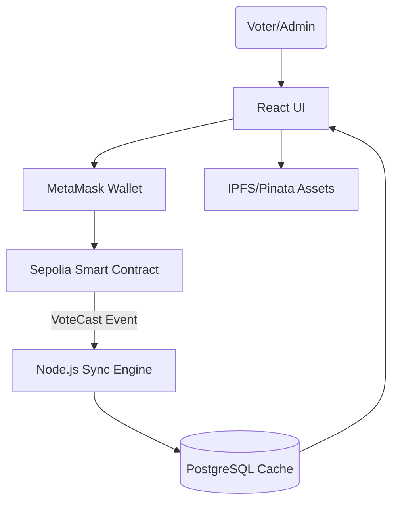

# IT Club Election System 🗳️

A production-grade, decentralized voting application built with a **Hybrid Web3 Architecture**. This system combines the immutability of the Ethereum blockchain with the speed of a traditional PostgreSQL database and the decentralization of IPFS.

## 🚀 Overview

This system was designed to solve the challenges of transparency and speed in campus elections. By using a hybrid approach, we ensure that:
- **Votes are Immutable**: Once cast on the blockchain, they cannot be altered.
- **UI is Instant**: Users don't wait for blockchain confirmations to see results; the backend syncs data in real-time.
- **Data is Decentralized**: Candidate images and student records are stored on IPFS.

## 🛠️ Tech Stack

- **Blockchain**: Solidity, Foundry, Sepolia Testnet.
- **Backend**: Node.js, Express, Ethers.js.
- **Database**: PostgreSQL (with event-driven sync).
- **Frontend**: React (Vite), Tailwind CSS, AuthContext API.
- **Storage**: IPFS (via Pinata).

## 🏗️ Architecture



## ✨ Key Features

- **Wallet Authentication**: Login via MetaMask with signature verification.
- **Role-Based Access**: Admin controls for registering candidates and starting/ending elections.
- **Hybrid Sync Engine**: A dedicated service that listens for blockchain events and updates the local database instantly.
- **Multi-Position Voting**: Single-transaction voting for President, Secretary, and 7 General Members.
- **Live Leaderboard**: Real-time polling of results from the cached database layer.
- **IPFS Integration**: Decentralized storage for all election media.

## 📦 Setup & Installation

### 1. Smart Contracts (Foundry)
```bash
cd contracts
forge build
# Deploy to Sepolia
forge script script/Deploy.s.sol --rpc-url $RPC_URL --broadcast --verify
```

### 2. Backend API
```bash
cd backend
npm install
# Configure .env with DATABASE_URL, RPC_URL, and CONTRACT_ADDRESS
npm start
```

### 3. Frontend
```bash
cd election-frontend
npm install
npm run dev
```

## 🔐 Security Features

1. **On-Chain Enforcement**: The `hasVoted` check is performed within the Smart Contract, making double-voting mathematically impossible.
2. **Admin Protection**: Critical functions (registering candidates, starting elections) are protected by the `onlyAdmin` modifier.
3. **Signature Verification**: The backend verifies wallet ownership via Ethers.js message signing to prevent API spoofing.


**Developed for the IT Club Election Project.** 🚀
