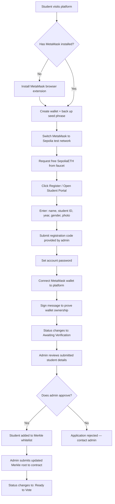
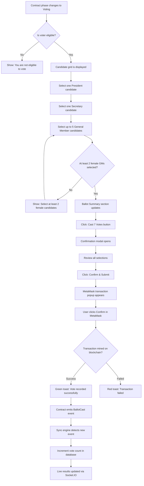
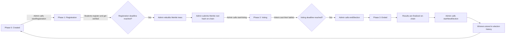
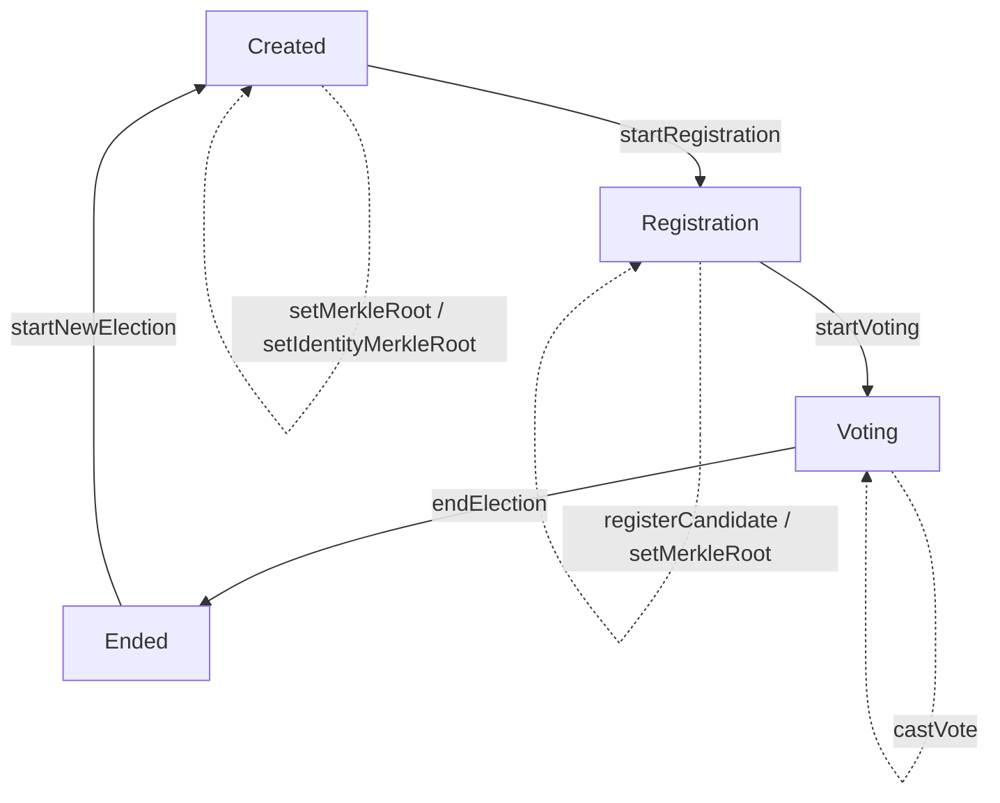
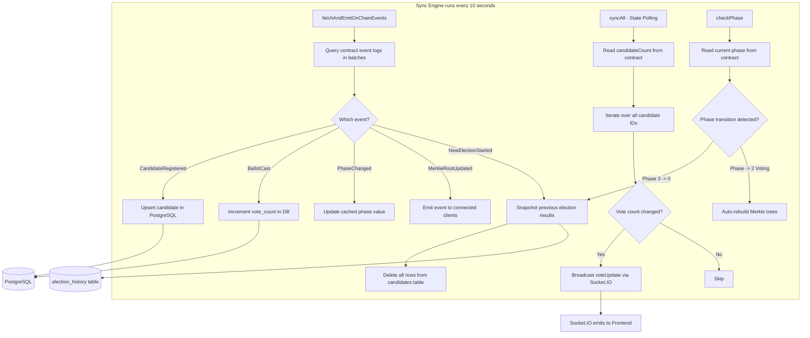
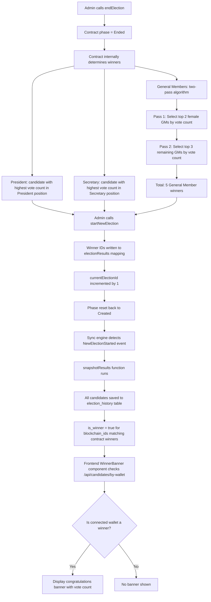
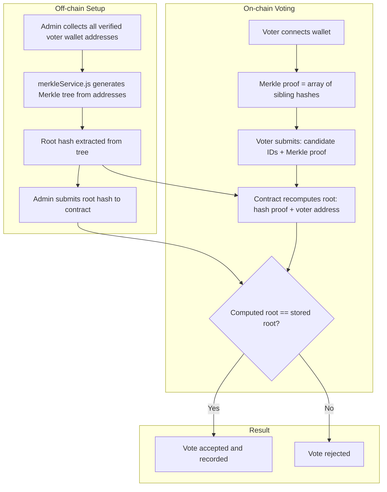
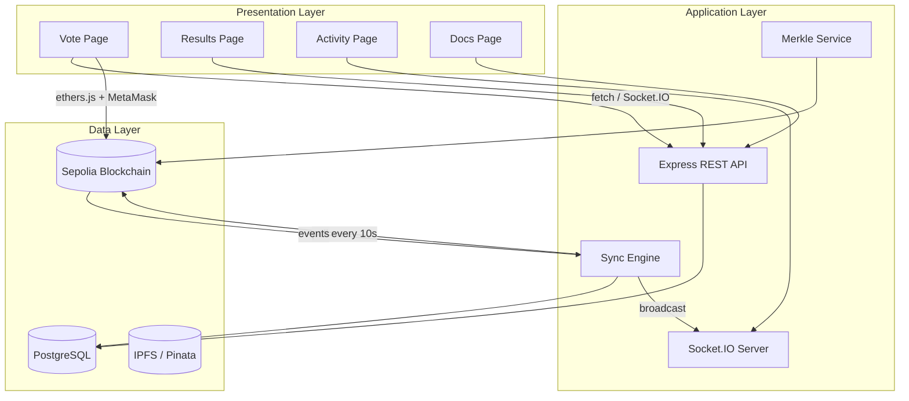

# System Flowcharts — Decentralized Voting System

## 1. Voter Registration & Verification Flow

---

## 2. Ballot Casting Flow

---

## 3. Election Lifecycle Flow

---

## 4. Smart Contract Phase State Machine

---

## 5. Blockchain Sync Engine Data Flow

---

## 6. Winner Selection & Result Declaration Flow

---

## 7. Merkle Proof Verification Flow

---

## 8. System Architecture Overview

---

*Generated for the Decentralized Voting System — IT Club Election*
