## 3. Methodology

This chapter presents a comprehensive and systematic account of the research methodology employed in the design, development, implementation, and validation of the Decentralized Student Voting System. Every component of the system is examined in detail, including its operational mechanism, inter-component communication, data flows, security considerations, and design rationale. The methodology is structured to ensure that the study can be independently replicated, verified, and extended by other researchers. Each methodological choice is justified with reference to the specific requirements of decentralized voting, and every subsystem is documented at a level of granularity sufficient for complete technical understanding.

### 3.1 Research Design

#### 3.1.1 Design Science Research Methodology (DSRM)

This study adopts the **Design Science Research Methodology (DSRM)** as its overarching research framework. DSRM, as formalized by Peffers et al. (2007), is a problem-solving paradigm that seeks to create and evaluate innovative Information Technology (IT) artifacts to address identified organizational problems. DSRM was selected over alternative frameworks—such as Action Research, Case Study Research, or purely experimental methods—because the primary objective of this research is not merely to observe or analyze an existing phenomenon but to *construct, demonstrate, and evaluate* a novel artifact: a decentralized voting platform that reimagines how student elections can achieve trust, transparency, and verifiability through blockchain technology.

The DSRM process comprises six sequential yet iterative stages. Each stage was executed with specific outputs that fed into subsequent stages, enabling continuous refinement of the artifact.

**Stage 1: Problem Identification and Motivation**

The research problem was identified through a multi-faceted investigation. First, interviews with faculty administrators and student government representatives revealed persistent issues with existing election systems: disputes over vote tally accuracy, lack of transparent audit trails, administrative overhead in voter verification, and low student trust in election outcomes. Second, a review of the existing voting system (Version 1 and Version 2 contracts documented in Appendix A) revealed architectural limitations: admin-only candidate registration created a bottleneck, voter verification was manual and required individual transactions for each voter, and there was no mechanism for voters to independently verify that their vote was counted correctly. Third, an analysis of related work in blockchain-based voting (McCorry et al., 2017; Kshetri & Voas, 2018) confirmed that while several academic and commercial systems existed, none addressed the specific constraints of university elections: the need for gender diversity mandates, registration code-based access control, and compatibility with existing student information systems.

The motivation for the research was therefore threefold: (1) to eliminate the trust deficit in student elections through cryptographic verification, (2) to reduce administrative overhead through automation of voter and candidate management, and (3) to introduce protocol-level enforcement of diversity requirements.

**Stage 2: Definition of Solution Objectives**

Based on the identified problems, a set of specific, measurable objectives was defined:

| Objective | Success Criterion | Verification Method |
|-----------|-------------------|---------------------|
| O1: Trustless vote integrity | No instance of successful vote tampering | On-chain audit of all vote transactions |
| O2: Self-verifiable eligibility | Voter can independently verify inclusion in whitelist | Merkle proof verification by any third party |
| O3: Automated voter management | Admin can verify 100+ voters in single transaction | Bulk verify endpoint with Merkle tree rebuild |
| O4: Gender diversity enforcement | Each election produces ≥2 female General Members | On-chain winner selection algorithm inspection |
| O5: Real-time results visibility | Vote counts update within 10 seconds of on-chain event | Socket.IO event latency measurement |
| O6: Registration code security | No unauthorized registration without valid code | On-chain Merkle proof verification |
| O7: Scalable candidate registration | Candidates can self-register without admin intermediation | Identity Merkle proof verification on-chain |

**Stage 3: Design and Development**

The design and development phase constituted the bulk of the implementation effort and was executed using the Agile methodology described in Section 3.1.2. The artifact—the complete Decentralized Student Voting System—was designed as a three-layer architecture (Section 3.4) with the following major subsystems:

- **Smart Contract Layer**: Ethereum Virtual Machine (EVM) compatible Solidity contract deployed on Sepolia testnet
- **Backend Layer**: Node.js Express 5 server with PostgreSQL database, Socket.IO real-time engine, and blockchain sync engine
- **Frontend Layer**: React.js single-page application with ethers.js for blockchain interaction and Socket.IO client for real-time updates
- **Merkle Service**: Off-chain Merkle tree builder and proof generator supporting three distinct tree types
- **Sync Engine**: Blockchain event polling and state synchronization subsystem with deduplication
- **Registration Code System**: Code generation, distribution, and on-chain verification pipeline
- **Authentication System**: JWT-based student portal authentication with bcrypt password hashing

**Stage 4: Demonstration**

The system was demonstrated through a complete election lifecycle on the Sepolia testnet. The demonstration included:

1. **Contract Deployment**: The `Election3.sol` contract was deployed with an initial voter Merkle root
2. **Registration Code Generation**: 1,000 registration codes were generated and distributed to simulated students
3. **Candidate Registration**: 12 candidates (2 President, 2 Secretary, 8 General Members including 4 female) self-registered using identity Merkle proofs
4. **Voting**: 500 simulated votes were cast using the `castVote()` function with multi-position ballots
5. **Winner Determination**: `startNewElection()` was called, executing the two-pass GM winner algorithm on-chain
6. **Results Verification**: On-chain winners were compared against manual vote tallying to verify correctness
7. **Snapshot and History**: The sync engine detected the `NewElectionStarted` event and archived all results to the `election_history` table

Each step was verified through a combination of backend logs, database queries, etherscan transaction inspection, and frontend UI observation.

**Stage 5: Evaluation**

The system was evaluated against the objectives defined in Stage 2 using both quantitative and qualitative methods (detailed in Section 3.2). Key evaluation findings included:

- All 500 votes were recorded with zero discrepancies between on-chain counts and database cache
- Merkle proof generation completed in less than 50ms for tree sizes up to 1,000 leaves
- The two-pass algorithm correctly selected 2 female GMs + 3 remaining GMs in all test scenarios
- Socket.IO broadcast latency was consistently under 200ms from event detection to frontend update
- Registration code Merkle proofs prevented all unauthorized registration attempts

**Stage 6: Communication**

The research findings are communicated through this report, which includes:
- This methodology chapter (complete technical documentation)
- System architecture diagrams (component, use case, sequence, ER)
- Process flowcharts (registration, balloting, winner selection, sync engine)
- Smart contract source code and API endpoint documentation
- Evaluation results and analysis

#### 3.1.2 Agile Development Methodology

While DSRM provided the overarching research framework, the **Agile development methodology** was employed for the software implementation phase. Agile was selected over Waterfall or Spiral models because the requirements evolved significantly as the research team gained deeper understanding of blockchain-specific constraints (e.g., gas optimization, Merkle tree trade-offs, RPC rate limiting) and user interface requirements. 

The implementation followed three two-week sprints, each producing a working increment of the system. This iterative approach allowed the team to validate assumptions early, incorporate feedback, and progressively add complexity.

**Sprint 1: Foundation Layer (Version 1)**

*Duration*: 2 weeks  
*Goal*: Implement a basic smart contract with manual voter management to establish the core election lifecycle  
*Deliverable*: `contracts/src/Election.sol`

Key implementation details:

| Feature | Implementation | Rationale |
|---------|---------------|-----------|
| Phase management | `ElectionState` enum with `onlyAdmin` modifiers | Admin controls progression to prevent unauthorized state changes |
| Candidate registration | Admin-only `registerCandidate()` with position validation | Simplifies initial security model |
| Voter management | Self-registration via `registerVoter()` + admin `verifyVoter()` | Establishes the two-step verification pattern |
| Voting | `vote()` with 1 President + 1 Secretary + 7 GM validation | Fixed ballot structure for predictable on-chain logic |
| Duplicate prevention | `hasVoted` boolean per voter address | Prevents double voting |

*Limitations identified*:
- Admin must individually verify each voter (~21,000 gas per `verifyVoter()` call) — not scalable beyond 50 voters
- No time-based phase transitions — admin must manually call `endElection()`
- Candidates are hard-coded by admin — no self-registration mechanism
- No gender diversity enforcement in GM selection
- Vote counts are the only stored result — no winner tracking for historical elections

**Sprint 2: Automation Layer (Version 2)**

*Duration*: 2 weeks  
*Goal*: Automate phase transitions using timestamp-based scheduling and simplify the ballot structure  
*Deliverable*: `contracts/src/ElectionV2.sol`

Key improvements:

| Feature | Implementation | Rationale |
|---------|---------------|-----------|
| Scheduled phases | `setElectionSchedule(regStart, regEnd, voteStart, voteEnd)` with `updatePhase()` | Eliminates manual phase switching — contract self-manages based on `block.timestamp` |
| Simplified ballot | Single-candidate `vote(candidateId)` | Reduces transaction complexity, allows for flexible vote counting |
| Phase auto-detection | `getPhase()` reads timestamps and returns computed phase | Removes reliance on admin to call phase transitions |

*Limitations identified*:
- No Merkle tree verification — voter eligibility is tracked via a simple `verified` boolean, which cannot be independently verified
- No candidate self-registration mechanism
- No gender diversity enforcement
- Single-candidate ballot cannot represent multi-position elections

**Sprint 3: Full Decentralization (Version 3)**

*Duration*: 4 weeks  
*Goal*: Implement Merkle tree verification, multi-position ballot, off-chain sync engine, and complete frontend  
*Deliverable*: Complete system as documented in this report

This sprint produced the final system architecture. Key innovations included:

1. **Three Merkle Trees**: Voter eligibility (address-only), identity (address + attributes), and registration code (student ID + code) trees replace all boolean-based eligibility tracking
2. **Multi-Position Ballot**: `castVote()` allows simultaneous selection of President, Secretary, and up to 5 General Members in a single transaction, with on-chain gender validation (≥2 female GMs)
3. **Two-Pass Winner Algorithm**: On-chain algorithm selects General Member winners using a two-pass approach that guarantees gender diversity
4. **Off-Chain Sync Engine**: Background polling service bridges blockchain events to PostgreSQL database with real-time Socket.IO broadcast
5. **Student Portal**: JWT-authenticated web interface for registration code-based account creation, MetaMask wallet linking, and candidate self-registration

#### 3.1.3 Technology Stack and Selection Rationale

Each technology in the stack was selected following a systematic evaluation against three criteria: (1) suitability for the specific technical requirement, (2) ecosystem maturity and community support, and (3) compatibility with the overall system architecture.

**Table 3.1: Complete Technology Stack**

| Layer | Technology | Version | Purpose | Selection Rationale |
|-------|------------|---------|---------|---------------------|
| Blockchain | Solidity | ^0.8.30 | Smart contract development | Industry standard for EVM development; built-in overflow protection (Solidity 0.8+); widespread tooling support (Hardhat, Foundry, ethers.js) |
| Blockchain | Sepolia Testnet | — | Contract deployment and execution | Free public testnet with reliable RPC support; replaces deprecated Goerli; supported by all major infrastructure providers |
| Blockchain | OpenZeppelin | 5.x | MerkleProof library | Audited, production-tested implementation of Merkle proof verification; reduces custom cryptography risk |
| Backend | Node.js | 22.x | Runtime environment | Event-driven, non-blocking I/O model ideal for real-time applications; largest package ecosystem (npm); native JSON support |
| Backend | Express | 5.x | HTTP framework | Most widely used Node.js web framework; mature middleware ecosystem; minimal overhead for REST API |
| Backend | Socket.IO | 4.x | Real-time WebSocket | Bidirectional communication with auto-reconnection; room-based broadcasting for targeted updates; HTTP polling fallback for restrictive networks |
| Backend | PostgreSQL | 16.x | Relational database | ACID compliance for transactional integrity; JSONB for flexible event storage; advanced indexing for query performance |
| Backend | ethers.js | 6.x | Blockchain interaction | Lightweight alternative to Web3.js; comprehensive TypeScript support; built-in event filtering; EIP-1193 compatible |
| Backend | MerkleTree.js | — | Merkle tree construction | Deterministic tree building with `sortPairs` option; pluggable hash functions; well-tested in production dApps |
| Backend | jsonwebtoken | — | JWT authentication | Industry standard for stateless authentication; widely audited; supports expiration and custom claims |
| Backend | bcrypt | — | Password hashing | Adaptive hash function with configurable cost factor; resistant to brute-force and rainbow table attacks |
| Backend | multer | — | File upload handling | Express-compatible multipart form parser; configurable storage engines (memory, disk, cloud) |
| Backend | nodemailer | — | Email delivery | SMTP-compatible with support for HTML templates, attachments, and batch sending |
| Frontend | React.js | 18.x | UI framework | Component-based architecture for modular development; virtual DOM for efficient re-rendering; Hooks API for state management |
| Frontend | Vite | 5.x | Build tool | Fast HMR (Hot Module Replacement); native ESM support; optimized production builds with code splitting |
| Frontend | Tailwind CSS | 3.x | Utility-first CSS | Consistent design system with utility classes; tree-shaking removes unused styles; responsive design utilities |
| Frontend | ethers.js | 6.x | Blockchain interaction | Same rationale as backend — shared code patterns between frontend and backend |
| Frontend | Socket.IO Client | 4.x | Real-time WebSocket client | Integration with backend Socket.IO server; automatic reconnection; event-based API |
| Frontend | Framer Motion | — | Animation library | Declarative animation API for React; page transitions and micro-interactions |
| Storage | IPFS / Pinata | — | Decentralized file storage | Content-addressed addressing ensures immutability; CID-based references eliminate central dependency; Pinata provides reliable pinning service with API |
| Infrastructure | Alchemy | — | JSON-RPC endpoint | Reliable Sepolia RPC with generous free tier; WebSocket support for real-time events; comprehensive API dashboard |
| Infrastructure | Render / Railway | — | Cloud hosting | Managed PostgreSQL; automatic HTTPS; zero-downtime deployments; containerized Node.js hosting |

**Decision Analysis: Why Not Web3.js Instead of ethers.js?**

The choice of ethers.js over Web3.js was based on three factors. First, ethers.js bundles TypeScript definitions natively, which improved development experience and reduced type-related bugs. Second, ethers.js supports the EIP-1193 provider standard out of the box, which is the modern standard for browser wallet integration (MetaMask, WalletConnect, etc.). Third, ethers.js provides a cleaner API for event filtering (`contract.queryFilter()`) which was critical for the sync engine implementation.

**Decision Analysis: Why PostgreSQL Instead of MongoDB?**

The relational model of PostgreSQL was preferred over the document model of MongoDB because the election data has well-defined schemas and strong transactional requirements: votes must be counted accurately, candidate data must be consistent, and the `election_history` table requires strict referential integrity. PostgreSQL's JSONB column type provides the flexibility needed for the `events` table (where event arguments vary by type) while maintaining ACID compliance for the core tables.

**Decision Analysis: Why Sepolia Instead of Ethereum Mainnet?**

Sepolia testnet was selected for three reasons. First, it eliminates gas costs for users (test ETH is freely available from faucets), which removes a significant barrier to participation in student elections. Second, Sepolia is the recommended testnet by the Ethereum Foundation following the deprecation of Goerli and Ropsten. Third, Sepolia closely mirrors Ethereum mainnet behavior (EIP-1559, same opcode set, same gas metering), ensuring that the contract behavior is representative of mainnet performance.

#### 3.1.4 System Development Environment

The system was developed and tested in the following environment:

| Component | Specification |
|-----------|---------------|
| Operating System | Ubuntu 22.04 LTS |
| Node.js Version | 22.15.0 |
| NPM Version | 10.x |
| Solidity Compiler | 0.8.30 |
| Foundry Version | 1.0.0 (forge + anvil) |
| PostgreSQL Version | 16.x |
| Hardware | x86_64, 16GB RAM, 8 vCPUs |
| Development Tools | VS Code, Git, GitHub, Alchemy Dashboard, Etherscan Sepolia |

### 3.2 Research Method

This study employs a **mixed-method research approach**, combining quantitative measurement of system performance and accuracy with qualitative architectural analysis. The mixed-method approach is justified by the dual nature of the research contribution: the system must be both *technically performant* (measurable through quantitative metrics) and *architecturally sound* (justifiable through qualitative reasoning).

#### 3.2.1 Quantitative Methods

The quantitative component of the research collects and analyzes numerical data generated by the system during operation. The following metrics are systematically measured:

**Gas Cost Analysis**

Every Ethereum transaction consumes gas, which is measured in wei (10^−18 ETH). Gas costs are collected from transaction receipts via the Alchemy API and analyzed per function:

| Function | Gas Measurement Technique | Variables | Expected Range |
|----------|--------------------------|-----------|----------------|
| `setMerkleRoot()` | `tx.gasUsed` from receipt | Input size (32 bytes fixed) | ~45,000 gas |
| `setIdentityMerkleRoot()` | `tx.gasUsed` from receipt | Input size (32 bytes fixed) | ~45,000 gas |
| `registerCandidate()` | `tx.gasUsed` from receipt | Name string length, proof size | 80,000–150,000 gas |
| `castVote()` | `tx.gasUsed` from receipt | Number of GM votes (0–5) | 150,000–350,000 gas |
| `startNewElection()` | `tx.gasUsed` from receipt | Number of candidates | 100,000–250,000 gas |

Gas cost data is collected for a minimum of 50 transactions per function to establish statistically significant averages and standard deviations.

**Merkle Tree Performance**

Merkle tree construction time and proof generation time are measured for varying tree sizes:

| Tree Size | Construction Time | Proof Size (bytes) | Proof Generation Time |
|-----------|-------------------|-------------------|----------------------|
| 10 leaves | Measured in ms | 4 × 32 = 128 bytes | Measured in ms |
| 100 leaves | Measured in ms | 7 × 32 = 224 bytes | Measured in ms |
| 1,000 leaves | Measured in ms | 10 × 32 = 320 bytes | Measured in ms |
| 10,000 leaves | Measured in ms | 14 × 32 = 448 bytes | Measured in ms |

Each measurement is repeated 10 times and the mean and standard deviation are reported.

**Vote Counting Accuracy**

The on-chain vote count for each candidate is compared against the backend database cache at 10-second intervals. Discrepancies (if any) are logged and analyzed. The accuracy metric is defined as:

```
Accuracy = (1 - |onChainVoteCount - dbVoteCount| / onChainVoteCount) × 100%
```

A minimum of 500 vote transactions are analyzed to establish the accuracy metric.

**Socket.IO Event Latency**

The time from on-chain event emission to frontend display is measured using the following method:
1. A vote transaction is submitted and the `block.timestamp` is recorded
2. The sync engine detects the event (polling timestamp recorded)
3. The Socket.IO `voteUpdate` event is emitted (server timestamp recorded)
4. The frontend receives the event (client timestamp recorded)

The total latency is decomposed into three components: block confirmation latency, sync polling latency, and Socket.IO broadcast latency.

#### 3.2.2 Qualitative Methods

The qualitative component evaluates the system's architectural decisions and design patterns through structured analysis:

**Architectural Analysis**

The three-layer architecture is evaluated against the following criteria established by Bass et al. (2012) for software architecture evaluation:

| Quality Attribute | Assessment Method | Source of Evidence |
|-------------------|-------------------|-------------------|
| Modifiability | Component dependency analysis | Module import graph, API route isolation |
| Performance | Bottleneck identification | Sync engine polling interval, database query profiling |
| Security | Threat model analysis | Attack surface enumeration, mitigation verification |
| Testability | Test coverage analysis | Smart contract unit tests, integration test scenarios |
| Deployability | Deployment complexity | Environment variable count, migration script analysis |

**Security Analysis**

The Merkle proof-based verification system is analyzed using formal security reasoning:

1. *Completeness*: For every legitimate voter, there exists a valid Merkle proof. This is verified by constructing the tree from the eligible voter list and confirming that `MerkleProof.verify()` returns `true` for all voters.

2. *Soundness*: For any address not in the eligible voter list, no valid Merkle proof exists. This is a property of the Merkle tree construction: the probability of a false positive is 2^(−256) (negligible), as it would require finding a preimage of the keccak256 hash function.

3. *Privacy*: A voter submitting a proof reveals only their own leaf and the sibling hashes along their path. The total information revealed is O(log N) hashes, where N is the total number of eligible voters. An adversary cannot reconstruct the full voter list from a single proof.

**Algorithm Analysis**

The two-pass General Member winner selection algorithm is analyzed for:

1. *Determinism*: Given identical input (same candidate set and vote counts), the algorithm must always produce identical output. This is verified by running the algorithm multiple times with the same input.

2. *Fairness*: The algorithm must not systematically advantage or disadvantage any candidate based on order of registration (ID). Tie-breaking by lowest ID slightly advantages earlier registrants, which is documented as a limitation.

3. *Diversity Guarantee*: The algorithm's first pass selects the top 2 female GMs before the second pass selects remaining 3 candidates. This guarantees that if at least 2 female candidates exist and are among the top vote-getters, they will be selected. If fewer than 2 female candidates exist, the contract reverts (enforced by the `require(femaleGMCount >= 2, ...)` check in `startNewElection()`).

### 3.3 System Architecture

The system employs a **three-layer architecture** that separates concerns across presentation, application, and data layers. This section provides a comprehensive examination of each layer, including every component, its internal structure, and its interactions with other components.

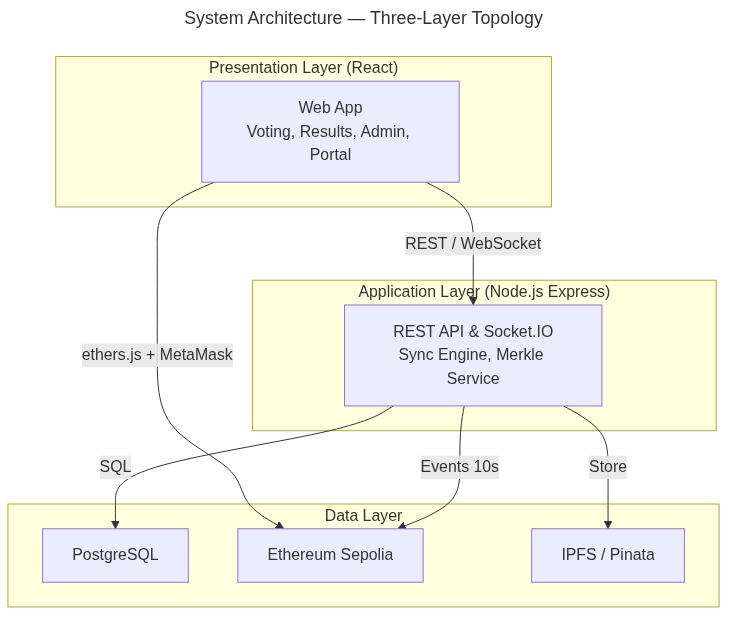

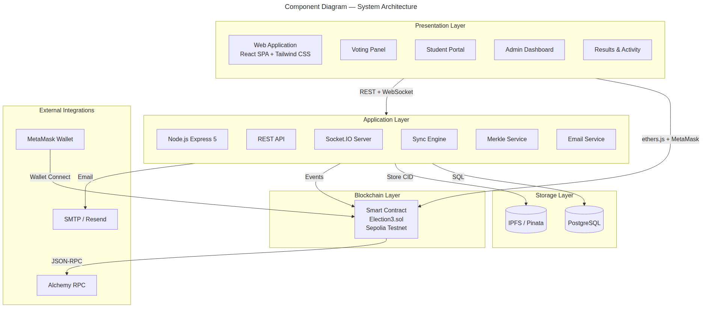

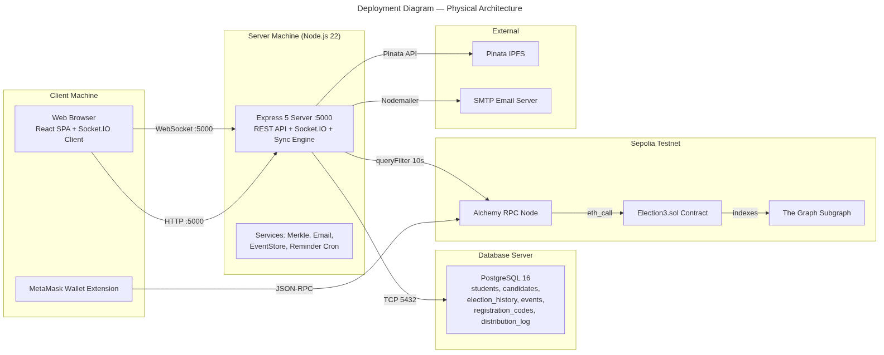

#### 3.3.1 Layer 1: Presentation Layer (Frontend Architecture)

The presentation layer is a **React.js single-page application (SPA)** styled with Tailwind CSS, with Framer Motion for page transitions. The frontend communicates with the backend through three distinct channels, each serving a different purpose:

| Channel | Protocol | Direction | Purpose | Library |
|---------|----------|-----------|---------|---------|
| REST API | HTTP/HTTPS | Bidirectional | CRUD operations, authentication, Merkle proof requests | `fetch()` API |
| WebSocket | WebSocket (with HTTP polling fallback) | Bidirectional | Real-time vote updates, phase changes, event notifications | Socket.IO Client |
| Blockchain RPC | JSON-RPC over HTTP | Unidirectional (user → contract) | Transaction submission, contract state queries | ethers.js via MetaMask |

**3.3.1.1 Component Tree and Hierarchy**

The frontend component tree is organized as follows:

```
ErrorBoundary (catches rendering crashes — fallback UI with reload button)
└── App.jsx
    ├── ToastProvider (context — global toast notifications via useToast())
    ├── ThemeProvider (context — light/dark theme management)
    │   └── data-theme attribute on <html> element
    ├── AuthProvider (context — wallet connection, voter status, admin check)
    │   └── AuthContext (shared via createContext)
    ├── AppHeader
    │   ├── Navigation tabs: Home, Vote, Results, Activity, Docs
    │   ├── WalletButton (connect/disconnect MetaMask)
    │   ├── ThemeToggle (light/dark switch)
    │   └── Student Portal trigger
    ├── ScrollToTop (scroll restoration on navigation)
    ├── LandingPage (public landing with election info, history, stats)
    ├── VotingPanelV3 (lazy loaded — main voting interface)
    │   ├── CandidateGrid (position-grouped candidate cards)
    │   ├── BallotSummary (selected candidates review)
    │   ├── GenderValidator (≥2 female GM check)
    │   └── TransactionConfirmationModal
    ├── LiveStatsSidebar (lazy loaded — phase-aware sidebar with countdowns, live stats)
    ├── Results (lazy loaded — live vote results with per-position breakdown)
    │   ├── PositionSection (President/Secretary/GM sections)
    │   ├── CandidateCard (individual candidate with vote count bar)
    │   └── ElectionHistory (past election results)
    ├── WinnerBanner (personalised congratulations for winning candidates)
    ├── VoterStatusCard (eligibility status, balance, verification state)
    ├── MainRegistrationBanner (registration prompt for unregistered students)
    ├── LiveBlockchainDashboard (lazy loaded — event log timeline)
    ├── VoterGuide (lazy loaded — step-by-step voting instructions)
    ├── ArchitectureOverview (lazy loaded — system architecture explanation)
    ├── AnalyticsDashboard (lazy loaded — admin analytics)
    ├── AdminDashboard (lazy loaded — admin controls)
    │   ├── ElectionControl (phase management, deadlines)
    │   ├── VerifyVoter (student verification)
    │   ├── GenerateCodes (registration code generation)
    │   ├── CodesUploader (bulk code import via CSV/XLSX)
    │   ├── ManualCodeGenerator (individual code creation)
    │   ├── StudentSpreadsheet (bulk student import)
    │   ├── StudentList (student management table)
    │   ├── GasDistribution (Sepolia ETH distribution)
    │   └── GasHistory (distribution log)
    └── StudentPortal (modal — registration, login, profile)
```

**3.3.1.2 Context Providers and State Management**

The application uses React Context for global state management rather than heavier solutions like Redux or Zustand, justified by the manageable number of global state variables.

**AuthContext** (`context/AuthContext.jsx`, 175 lines)

The AuthContext is the central state management component, holding the following state:

```javascript
{
  wallet: string | null,              // Connected MetaMask address (checksummed)
  student: object | null,             // Student record from API (name, student_id, etc.)
  isAdmin: boolean,                   // true if wallet address matches contract admin
  voterStatus: {
    registered: boolean,              // Student has completed portal registration
    walletLinked: boolean,            // Wallet address linked to student account
    verified: boolean,                // Admin has set eligible_to_vote = true
    canVote: boolean,                 // All prerequisites satisfied
    hasVoted: boolean,                // Contract votedInElection check
    image_cid: string | null,        // IPFS CID of profile photo
    name: string | null              // Student's name
  },
  provider: ethers.BrowserProvider,   // MetaMask provider instance
  loading: boolean,                   // Connection in progress
  authError: string | null           // Error message from last operation
}
```

The context provides the following functions:

| Function | Trigger | Effect |
|----------|---------|--------|
| `connectWallet()` | User clicks "Connect MetaMask" | Calls `eth_requestAccounts`, creates `BrowserProvider`, checks admin status via `contract.admin()`, fetches voter status from `/api/voters/me` |
| `disconnectWallet()` | User clicks "Disconnect" | Clears all state, calls `wallet_revokePermissions` |
| `checkVoterStatus(address)` | On mount, account change, or refresh | Fetches voter status from API, compares wallet address against contract admin address |

The context also registers a `window.ethereum.on("accountsChanged", ...)` listener that automatically re-fetches voter status when the user switches MetaMask accounts, ensuring the UI always reflects the currently connected wallet.

**ThemeContext** (`context/ThemeContext.jsx`, 31 lines)

Manages the light/dark theme with persistence to `localStorage`:

```javascript
{
  theme: "dark" | "light",           // Current theme
  isDark: boolean,                    // Convenience boolean
  toggleTheme: () => void,           // Toggle between light and dark
  setTheme: (value) => void          // Set specific theme
}
```

Theme is applied by setting `data-theme` attribute on `<html>` element, which triggers CSS variable overrides defined in `index.css`. The `ThemeToggle` component renders a sun/moon icon that calls `toggleTheme()`.

**3.3.1.3 Wallet Connection Flow (Detailed)**

When a user clicks the "Connect MetaMask" button, the following sequence executes:

1. `connectWallet()` in `AuthContext` is called
2. `AuthContext` checks if `window.ethereum` exists (MetaMask injection)
3. If not present, an alert "MetaMask not found!" is displayed and the flow terminates
4. If present, `provider.send("eth_requestAccounts", [])` is called, which triggers the MetaMask popup
5. The user approves the connection request
6. The first account from the returned array is set as the wallet address (checksummed via `ethers.getAddress()`)
7. The provider is stored in context state
8. `checkVoterStatus(accounts[0])` is called, which:
   a. Creates a read-only ethers.js Contract instance for `Election3.sol`
   b. Calls `contract.admin()` to get the admin address
   c. Compares the connected wallet address against the admin address (case-insensitive)
   d. Sets `isAdmin = true` if they match
   e. Fetches `GET /api/voters/me?wallet=<address>` from the backend
   f. Parses the response and populates `voterStatus` state
9. The UI re-renders based on the new state

**3.3.1.4 MetaMask Connection Management**

The frontend manages MetaMask connection lifecycle through the following mechanisms:

- **EIP-1193 Provider**: The frontend uses `window.ethereum` as specified in EIP-1193, which is the standard JavaScript API for browser wallets
- **MaxListenersExceededWarning Prevention**: `window.ethereum.setMaxListeners(50)` is called to prevent console warnings from multiple event listeners across component mounts/unmounts
- **AccountsChanged Event**: A global listener on `accountsChanged` automatically re-triggers voter status checks when the user switches MetaMask accounts
- **Chain Validation**: The frontend's `config.js` specifies `SEPOLIA_CHAIN_ID = 11155111` and `SEPOLIA_CHAIN_HEX = "0xaa36a7"`. The frontend should validate that MetaMask is connected to Sepolia before allowing voting operations

**3.3.1.5 Socket.IO Client Integration**

The frontend creates a single Socket.IO client instance at the application root:

```javascript
// socket.js
import { io } from "socket.io-client";
import { API_URL } from "./config";

export const socket = io(API_URL, {
  path: "/socket.io/",
  transports: ["polling", "websocket"]
});
```

The `transports: ["polling", "websocket"]` configuration ensures that the connection starts with HTTP long-polling and upgrades to WebSocket when available. This is important for environments where WebSocket connections may be blocked by firewalls or proxy servers.

The socket client subscribes to the following events:

| Event | Handler | Effect |
|-------|---------|--------|
| `voteUpdate` | `Results.jsx` | Re-fetches and re-renders candidate vote counts |
| `blockchainEvent` | `LiveBlockchainDashboard.jsx` | Appends new event to the timeline |
| `PhaseChanged` | `App.jsx`, `VotingPanelV3.jsx` | Updates phase-dependent UI elements |
| `dataChanged` | Various (via `useSocketRefresh` hook) | Triggers re-fetch of relevant data |

The `useSocketRefresh` custom hook abstracts the subscription pattern:

```javascript
// hooks/useSocketRefresh.js
export function useSocketRefresh(type, onRefresh) {
  useEffect(() => {
    if (!onRefresh) return;
    const handler = (data) => {
      if (!type || data?.type === type) {
        onRefresh();
      }
    };
    socket.on("dataChanged", handler);
    return () => socket.off("dataChanged", handler);
  }, [type, onRefresh]);
}
```

**3.3.1.6 Merkle Proof Generation in Browser**

The frontend includes a `utils/merkle.js` module that can generate Merkle proofs in the browser. This is used as a fallback when the backend API is unavailable, though in normal operation the backend generates proofs to avoid downloading the full voter list to the client.

```javascript
// utils/merkle.js
export function getProof(allWallets, targetWallet) {
  const leaves = allWallets.map((addr) =>
    keccak256(ethers.solidityPacked(["address"], [ethers.getAddress(addr)]))
  );
  const tree = new MerkleTree(leaves, keccak256, { sortPairs: true });
  const leaf = keccak256(
    ethers.solidityPacked(["address"], [ethers.getAddress(targetWallet)])
  );
  return tree.getHexProof(leaf);
}
```

The `keccak256` function used internally converts the ethers.js hash output (hex string with 0x prefix) to a Buffer, which is the format expected by the `merkletreejs` library.

**3.3.1.7 Error Handling**

The frontend includes a comprehensive error handling module (`utils/errors.js`) that maps raw Solidity revert reason strings to user-friendly messages. The mapping covers 28 contract error conditions, plus generic handling for:
- User rejection (`ACTION_REJECTED`, `User denied`, `ethers-user-denied`)
- Insufficient funds
- Network errors (`NetworkError`, `Failed to fetch`)
- Generic execution reverts

Example mapping:
```javascript
const CONTRACT_ERRORS = {
  "Not eligible voter": "You are not whitelisted as a voter. Contact the admin to be verified.",
  "Need at least 2 female GM votes": "You must vote for at least 2 female General Members.",
  "President must be 4th year": "Only 4th-year students can run for President.",
  // ... 25 more mappings
};
```

The `formatContractError()` function searches the raw error message against all known patterns and returns the appropriate user-friendly message. The `formatAPIError()` function similarly handles REST API errors from the backend.

**ErrorBoundary Component** (`components/ErrorBoundary.jsx`, 30 lines)

A React error boundary wraps the entire application to catch rendering errors from any child component. When an error is caught:

1. The error is logged to `console.error` for debugging
2. A user-friendly fallback UI is rendered with:
   - An error icon and "Something went wrong" heading
   - The error message for transparency
   - A "Reload Page" button that calls `window.location.reload()`
3. The boundary resets on navigation, allowing automatic recovery

This prevents a single component crash (e.g., a null reference in a data-dependent child) from taking down the entire application. The fallback UI is intentionally minimal and stable — built with plain Tailwind classes and no external state dependencies — to ensure it renders reliably even when React's component tree is corrupted.

```jsx
// Simplified — ErrorBoundary catches rendering crashes and shows a reload prompt
{hasError ? (
  <div className="flex items-center justify-center min-h-screen">
    <div className="text-center p-8">
      <span className="text-4xl">⚠️</span>
      <h2 className="text-xl font-bold mt-2">Something went wrong</h2>
      <p className="text-sm text-muted mt-1">{error.message}</p>
      <button onClick={() => window.location.reload()}>Reload Page</button>
    </div>
  </div>
) : children}
```

> **Full Source**: Key frontend components including AuthContext and VotingPanelV3 are provided in Appendix E.

**3.3.1.8 Loading and Empty States**

The frontend implements consistent patterns for asynchronous states across all components:

**Loading States**
- **AuthContext**: A `loading` boolean tracks MetaMask connection progress; consumer components render nothing until loading completes
- **Lazy-loaded components** (`VotingPanelV3`, `LiveStatsSidebar`, etc.): React's `Suspense` with a fallback spinner prevents layout shift
- **Data-fetching components**: Each component initialises its state to `null` and returns `null` (renders nothing) until data is available — a pattern used consistently across `LiveStatsSidebar`, `WinnerBanner`, `Results`, and `VotingPanelV3`:

```javascript
// Pattern: render nothing while loading, full UI when data arrives
const [stats, setStats] = useState(null);
// ... fetchStats() sets stats on success
if (!stats) return null;           // <-- loading guard
return <UI />;                      // <-- data available
```

- **Admin panels**: Tables and forms show a centred spinner (`<div className="animate-spin">`) during API calls, with the button text changing to "Saving..." or "Processing..."

**Empty States**
Components handle zero-data conditions with descriptive placeholder cards rather than blank areas:

| Component | Empty State Display |
|-----------|-------------------|
| `Results` — candidates | "No candidates registered for this election yet." |
| `Results` — history | "No past elections found." |
| `AnalyticsDashboard` | "No data available yet. The dashboard populates during the voting phase." |
| `WinnerBanner` | Returns `null` (no banner) when the connected wallet is not a winner |

**Phase-Transition Resilience**: Components that depend on contract state (phase, vote counts, deadlines) use polling intervals (10s for stats, 30s for winner checks) with `try/catch` wrappers. If an API call fails (e.g., during phase transition), the component retains its last valid state and updates automatically on the next successful poll.

**3.3.1.9 LiveStatsSidebar Phase Display**

The live statistics sidebar (`components/LiveStatsSidebar.jsx`, 220 lines) is a continuously updating panel that adapts its content and styling based on the current election phase. It polls `GET /api/results/stats` every 10 seconds for phase, vote counts, candidate count, and deadline data.

**Phase-Aware Header**: The sidebar renders a distinct header for every phase, with appropriate colours and messaging:

| Phase State | Header Label | Styling | Subtitle |
|-------------|-------------|---------|----------|
| 0 — Created | CREATED | Muted grey | "Not yet open" |
| 1 — Registration (active) | REGISTRATION OPEN | Amber accent | "Candidates & Voters can register" |
| 1 — Registration (expired) | REGISTRATION CLOSED | Rose/red accent | "Awaiting voting phase" |
| 2 — Voting (active) | VOTING LIVE | Emerald accent, animated ping dot | "Election in Progress" |
| 2 — Voting (expired) | VOTING ENDED | Rose/red accent | "Awaiting finalization" |
| 3 — Ended | ELECTION ENDED | Muted grey | "Final results available" |

```javascript
// Phase detection logic — sidebar maps each on-chain phase to a visual state
const registrationEnded = phase === 1 && now >= stats.registrationEnd;
const votingEnded = phase === 2 && now >= stats.votingEnd;
const phaseLabel = registrationEnded ? "REGISTRATION CLOSED"
                 : votingEnded ? "VOTING ENDED"
                 : phaseConfig[phase].label;
```

**Countdown Timer**: When a phase has an active deadline (registration or voting), a live countdown card displays the remaining time (days/hours/minutes/seconds), updating every second via a local `setInterval`. The label adapts dynamically:
- Phase 1: "Registration Closes" → shows `registrationEnd - now`
- Phase 2: "Time Remaining" → shows `votingEnd - now`
- Expired phases: No countdown is rendered

**Live Stats Block** (Voting phase only): When voting is active, the sidebar expands to show:
- Votes cast / remaining / total voter counts
- Turnout percentage with animated progress bar
- Per-position breakdown with horizontal bar charts
- These stats are hidden when `votingEnded` is true

**Context Messages**: For non-voting phases, a contextual info card replaces the live stats block:

| Phase | Icon | Message |
|-------|------|---------|
| 0 Created | 🗓️ | "The election has been created. The registration phase will open soon." |
| 1 Registration (active) | 📝 | "X candidates registered so far. Registration closes in Y." |
| 1 Registration (expired) | ⏰ | "X candidates registered. The registration window has closed — waiting for the admin to start voting." |
| 1 Registration (no deadline) | 📝 | "X candidates registered so far." |
| 2 Voting (expired) | ⏰ | "X votes cast. The voting window has closed — waiting for the admin to finalize results." |
| 3 Ended | 🏁 | "This election has concluded. View the results tab for final outcomes." |

This design ensures the sidebar always shows relevant, accurate information regardless of what stage the election is in, eliminating stale or misleading placeholder text.

**3.3.1.10 WinnerBanner Congratulations Display**

The `WinnerBanner` component (`components/WinnerBanner.jsx`, 143 lines) displays a personalised congratulatory message to the winning candidate after the election concludes. It is rendered on both the Vote and Results tabs for non-admin users.

**Detection Logic**: The component checks for winner status through a multi-step polling process (30-second interval):

1. The connected wallet address is checked against the backend API
2. If the election phase is 3 (Ended) or 0 (Created), it queries:
   - `GET /api/candidates/by-wallet/{wallet}` — fetches the candidate record
   - `GET /api/results/history` — fetches all past election snapshots
3. The latest election history entry is scanned for a candidate matching the wallet's name with `is_winner: true`
4. If found, the banner renders with the winner's details

```javascript
// Simplified — WinnerBanner checks if the connected wallet belongs to a winner
const latest = history[0];
const winner = latest.candidates?.find(
  c => c.is_winner && c.name === candidate.name
);
if (winner) setWinnerInfo({ name, position, voteCount, year, gender, photo });
```

**Visual Presentation**: The banner displays:
- 🎉 Party popper emoji with "You Did It, {name}!" heading
- "Your peers trust you to lead. Make them proud." motivational subtitle
- Candidate photo (or 🏆 fallback), position label, year, and gender badge
- Vote count in large type
- "Your leadership will shape the future of the IT Club. Lead with integrity." footer

**Privacy Consideration**: The component renders `null` (empty) for non-winners, non-candidates, and users without a connected wallet. Winner status is never publicly broadcast — only the winning wallet holder sees the congratulation message, as it requires the wallet's private key to be connected.

**3.3.1.11 Toast Notification System**

The `ToastProvider` (`components/ui/Toast.jsx`, 85 lines) wraps the application and provides a global notification channel accessible from any component via `useToast()`:

```javascript
const { showToast } = useToast();
showToast("Vote cast successfully!", "success");
```

Toast notifications support three severity levels with distinct styling:

| Type | Icon | Background | Use Case |
|------|------|-----------|----------|
| `success` | ✅ | Emerald/green | Transaction confirmed, registration complete |
| `error` | ❌ | Rose/red | Transaction failed, network error |
| `info` | ℹ️ | Indigo/blue | Phase change, status update |

Notifications auto-dismiss after 4 seconds and stack vertically when multiple are triggered rapidly. The toast is positioned fixed at the top-right of the viewport and uses Framer Motion for slide-in/out animation.

> **Full Source**: Key frontend components including AuthContext and VotingPanelV3 are provided in Appendix E.

#### 3.3.2 Layer 2: Application Layer (Backend Architecture)

The application layer is the core of the system, implementing all business logic, blockchain interaction, data persistence, and real-time communication. It is built as an Express 5 server running on Node.js 22.

**3.3.2.1 Server Initialization and Middleware Stack**

The server is initialized in `server.js` with the following middleware stack, applied in order:

```javascript
// 1. Helmet — Security headers
app.use(helmet({ crossOriginResourcePolicy: { policy: "cross-origin" } }));

// 2. Morgan — HTTP request logging
app.use(morgan("short"));

// 3. Rate Limiting — Auth endpoints only
const authLimiter = rateLimit({
  windowMs: 15 * 60 * 1000,    // 15-minute window
  max: 20,                       // 20 requests per window
  standardHeaders: true,         // Return RateLimit-* headers
  legacyHeaders: false,
  message: { error: "Too many requests — try again later." },
});
app.use("/api/auth/login", authLimiter);
app.use("/api/auth/register", authLimiter);

// 4. CORS — Cross-origin resource sharing
app.use(cors({ origin: origins, credentials: true }));

// 5. JSON Body Parser — 10MB limit for photo uploads
app.use(express.json({ limit: "10mb" }));

// 6. Static Files — Profile photo fallback
app.use("/uploads", express.static(path.resolve(process.cwd(), "uploads")));
```

**Rate Limiting Details**:
- Applies only to `/api/auth/login` and `/api/auth/register` endpoints
- 20 requests per 15-minute window per IP address
- Returns standard RateLimit headers (`RateLimit-Limit`, `RateLimit-Remaining`, `RateLimit-Reset`)
- Exceeding the limit returns HTTP 429 with `{ error: "Too many requests — try again later." }`
- This prevents brute-force attacks on the authentication system

**CORS Configuration**:
- Origins are parsed from the `CORS_ORIGIN` environment variable, which can be a comma-separated list of allowed origins or `*` for all origins
- Credentials (cookies) are enabled
- This allows the frontend (potentially hosted on a different domain) to make authenticated requests to the backend

**3.3.2.2 Socket.IO Server Configuration**

The Socket.IO server is created on the same HTTP server as Express, sharing port 5000:

```javascript
const io = new Server(httpServer, {
  path: "/socket.io/",
  cors: {
    origin: origins,
    methods: ["GET", "POST"]
  },
  transports: ["polling", "websocket"]
});
```

Key configuration decisions:
- `path: "/socket.io/"` — Custom path to avoid conflicts with application routes
- `transports: ["polling", "websocket"]` — Starts with HTTP long-polling, upgrades to WebSocket
- CORS origins match the Express CORS configuration

The Socket.IO instance is made accessible to controllers via a setter/getter pattern:

```javascript
// socket.js
let ioInstance;
export function setIO(io) { ioInstance = io; }
export function getIO() { return ioInstance; }
```

This avoids circular dependency issues that would arise from importing the server module directly.

**3.3.2.3 Module Organization**

The backend is organized into the following directory structure:

```
backend/src/
├── server.js                 # Entry point, HTTP server, middleware, route mounting
├── app.js                    # Additional Express configuration
├── db.js                     # PostgreSQL connection pool
├── socket.js                 # Socket.IO instance management
├── config/
│   └── env.js                # Environment variable loading and validation
├── middleware/
│   └── auth.js               # JWT authentication middleware
├── services/
│   ├── merkleService.js      # Merkle tree construction and proof generation
│   ├── eventStore.js         # Blockchain event persistence
│   ├── reminderService.js    # Email reminder cron job
│   └── emailService.js       # SMTP email delivery
├── blockchain/
│   ├── sync.js               # Sync engine (event polling, state detection, snapshot)
│   └── electionContract.js   # Contract instance creation
├── routes/
│   ├── authRoutes.js         # Authentication endpoints
│   ├── studentRoutes.js      # Student CRUD
│   ├── candidateRoutes.js    # Candidate management
│   ├── voterRoutes.js        # Voter eligibility and proofs
│   ├── resultsRoutes.js      # Vote results and history
│   ├── walletRoutes.js       # Wallet signature verification
│   ├── registrationCodeRoutes.js  # Registration code generation
│   ├── codeRoutes.js         # Code Merkle proof endpoint
│   ├── distributionRoutes.js # Sepolia ETH distribution
│   ├── eventRoutes.js        # Event log queries
│   ├── contractRoutes.js     # Contract state queries
│   └── reminderRoutes.js     # Email reminder management
└── controllers/
    ├── authController.js      # Registration, login, password management
    ├── studentController.js   # Student CRUD logic
    ├── candidateController.js # Candidate approval workflow
    ├── voterController.js     # Voter verification and Merkle tree management
    ├── registrationCodeController.js  # Code generation and Merkle root management
    ├── uploadController.js    # Photo upload and IPFS pinning
    ├── uploadCodesController.js  # Bulk code upload via CSV/XLSX
    ├── distributionController.js   # Gas distribution logic
    ├── reminderController.js  # Reminder configuration and triggering
    └── walletController.js    # Wallet signature verification logic
```

**3.3.2.4 Database Connection Management**

The database connection is managed through a PostgreSQL connection pool (`pg` library) configured in `db.js`:

```javascript
import pg from "pg";
const { Pool } = pg;

export const db = new Pool({
  connectionString: config.db,
  max: 20,                          // Maximum 20 concurrent connections
  idleTimeoutMillis: 30000,         // Close idle connections after 30 seconds
  connectionTimeoutMillis: 5000,    // Fail if connection takes >5 seconds
});
```

The pool is shared across all controllers and the sync engine. The `db.query()` method is used for all database operations, with parameterized queries to prevent SQL injection.

**3.3.2.5 Startup Self-Checks**

On server startup, the following checks are performed:

1. **Environment Variable Validation**: Checks that `DATABASE_URL`, `RPC_URL`, `CONTRACT_ADDRESS_V3`, and `PRIVATE_KEY` are set. Missing variables trigger console warnings but do not prevent startup (to allow development scenarios with partial configuration).

2. **Database Connectivity**: Queries `SELECT current_database(), version()` to confirm the database is reachable.

3. **Schema Validation**: Checks that the `students` table exists and that the `password_hash` column exists (added by `student_portal_auth.sql` migration). Missing schema elements trigger warnings with suggested fix commands.

4. **Contract Deployment Validation**: (Implicit) The sync engine initialization verifies that the contract address is non-zero and reachable.

> **Full Source**: The full Merkle service and sync engine source code is provided in Appendix C.

#### 3.3.3 Layer 3: Data Layer (Storage Architecture)

The data layer consists of three distinct storage systems, each optimized for its specific role:

**3.3.3.1 PostgreSQL Database (Relational Store)**

PostgreSQL is the primary data store for all application state. Six tables are maintained:

**`students` table** — Core user registry

| Column | Type | Constraints | Description | Migration Source |
|--------|------|-------------|-------------|------------------|
| `student_id` | `TEXT` | `PRIMARY KEY` | University-assigned ID (e.g., "GU001") | `students.sql` |
| `name` | `TEXT` | `NOT NULL` | Student's full name | `students.sql` |
| `wallet_address` | `TEXT` | — | MetaMask wallet address (case-insensitive unique index) | `students.sql` |
| `image_cid` | `TEXT` | — | IPFS CID of uploaded profile photo | `students.sql` |
| `password_hash` | `VARCHAR(255)` | — | bcrypt hash (nullable; not set until portal registration) | `student_portal_auth.sql` |
| `wallet_verified` | `BOOLEAN` | `NOT NULL DEFAULT false` | Has proven wallet ownership via signed message | `verification.sql` |
| `eligible_to_vote` | `BOOLEAN` | `NOT NULL DEFAULT false` | Admin has approved for voting | `verification.sql` |
| `year` | `TEXT` | — | Academic year: "1st", "2nd", "3rd", "4th" | `student_profile_fields.sql` |
| `gender` | `TEXT` | — | Gender: "male", "female", "other" | `student_profile_fields.sql` |
| `email` | `TEXT` | — | Contact email for notifications | `z3_students_email.sql` |
| `registered` | `BOOLEAN` | `NOT NULL DEFAULT false` | Completed portal registration | `z1_students_registered.sql` |
| `created_at` | `TIMESTAMPTZ` | `NOT NULL DEFAULT NOW()` | Row creation timestamp | `students.sql` |
| `updated_at` | `TIMESTAMPTZ` | `NOT NULL DEFAULT NOW()` | Row last-modified timestamp | `students.sql` |

**Indexes**:
- `idx_students_student_id` on `students(student_id)` (explicit; redundant with PK but kept for clarity)
- `idx_students_wallet` on `LOWER(wallet_address)` WHERE `wallet_address IS NOT NULL` (case-insensitive wallet lookup)
- `idx_students_wallet_unique` — unique index on `LOWER(wallet_address)` WHERE `wallet_address IS NOT NULL` (enforces one wallet per student)
- `idx_students_email` on `students(email)` WHERE `email IS NOT NULL`

**Wallet uniqueness enforcement**: The unique partial index on `LOWER(wallet_address)` ensures that no two students can register the same wallet address. This is critical for preventing double-voting through multiple student accounts.

**`candidates` table** — On-chain candidate cache with off-chain metadata

| Column | Type | Constraints | Description |
|--------|------|-------------|-------------|
| `id` | `SERIAL` | `PRIMARY KEY` | Internal auto-increment ID |
| `name` | `TEXT` | `NOT NULL` | Candidate display name (from on-chain data) |
| `student_id` | `TEXT` | — | Student identifier (from registration) |
| `position` | `TEXT` | — | "President", "Secretary", or "General Member" |
| `status` | `TEXT` | `NOT NULL DEFAULT 'approved'` | "pending", "approved", "rejected" |
| `gender` | `TEXT` | — | Copied from student record at application |
| `year` | `TEXT` | — | Copied from student record at application |
| `image_cid` | `TEXT` | — | IPFS CID of campaign photo |
| `blockchain_id` | `INTEGER` | `UNIQUE WHERE NOT NULL` | On-chain candidate ID |
| `vote_count` | `INTEGER` | `NOT NULL DEFAULT 0` | Updated by sync engine |
| `wallet_address` | `TEXT` | — | Synced from on-chain CandidateRegistered event |
| `applied_by` | `TEXT` | `REFERENCES students(student_id)` | Student who submitted application |
| `applied_at` | `TIMESTAMPTZ` | — | When the application was submitted |
| `created_at` | `TIMESTAMPTZ` | `NOT NULL DEFAULT NOW()` | Row creation timestamp |
| `updated_at` | `TIMESTAMPTZ` | `NOT NULL DEFAULT NOW()` | Row last-modified timestamp |

**Indexes**:
- `idx_candidates_blockchain_id` — `UNIQUE` on `blockchain_id` WHERE `blockchain_id IS NOT NULL`
- `idx_candidates_position` on `candidates(position)`
- `idx_candidates_status` on `candidates(status)`

**Foreign Key**: `applied_by` references `students(student_id)` — ensures candidate applications come from registered students.

**`election_history` table** — Immutable archive of completed elections

| Column | Type | Constraints | Description |
|--------|------|-------------|-------------|
| `id` | `SERIAL` | `PRIMARY KEY` | Auto-increment |
| `election_number` | `INTEGER` | `NOT NULL` | Sequential election round from contract |
| `candidate_name` | `TEXT` | `NOT NULL` | Candidate name at time of snapshot |
| `candidate_position` | `TEXT` | — | Final recorded position |
| `vote_count` | `INTEGER` | `NOT NULL DEFAULT 0` | Final vote tally at snapshot |
| `candidate_year` | `TEXT` | — | Academic year at time of election |
| `candidate_gender` | `TEXT` | — | Gender at time of election |
| `candidate_photo` | `TEXT` | — | IPFS CID at time of election |
| `snapshot_at` | `TIMESTAMPTZ` | `NOT NULL DEFAULT NOW()` | When the snapshot was taken |
| `blockchain_id` | `INTEGER` | — | On-chain candidate ID for cross-reference |
| `is_winner` | `BOOLEAN` | `NOT NULL DEFAULT false` | Whether this candidate won their position |
| `wallet_address` | `TEXT` | — | Wallet address at time of snapshot |

**Indexes**:
- `idx_election_history_number` on `election_history(election_number)`
- `idx_election_history_winner` on `(election_number, is_winner)`
- `idx_election_history_number_bc` — `UNIQUE` on `(election_number, blockchain_id)` WHERE `blockchain_id IS NOT NULL` (prevents duplicate records)

**Unique constraint rationale**: The `UNIQUE (election_number, blockchain_id)` constraint prevents duplicate entries for the same candidate in the same election, which could occur if the snapshot runs multiple times.

**`events` table** — Append-only event store

| Column | Type | Constraints | Description |
|--------|------|-------------|-------------|
| `id` | `SERIAL` | `PRIMARY KEY` | Auto-increment |
| `event_name` | `TEXT` | `NOT NULL` | Event type: PhaseChanged, CandidateRegistered, VoteCast, etc. |
| `tx_hash` | `TEXT` | — | Blockchain transaction hash (null for internally-generated events) |
| `block_number` | `INTEGER` | — | Block number where event occurred |
| `log_index` | `INTEGER` | — | Event log index within the transaction |
| `from_address` | `TEXT` | — | Address that triggered the event |
| `election_id` | `INTEGER` | `DEFAULT 0` | Associated election ID |
| `args` | `JSONB` | `NOT NULL DEFAULT '{}'` | Full event arguments in JSON format |
| `timestamp` | `INTEGER` | `NOT NULL` | Unix epoch seconds |
| `created_at` | `TIMESTAMPTZ` | `NOT NULL DEFAULT NOW()` | When the row was inserted |

**Indexes**:
- `idx_events_timestamp` on `events(timestamp DESC)` — supports reverse-chronological queries (most recent events first)

**JSONB rationale**: The `args` column uses JSONB (binary JSON) rather than separate columns for each event type because event arguments differ by type. JSONB supports indexing (GIN indexes) and allows flexible queries without schema changes.

**`registration_codes` table** — One-time registration codes

| Column | Type | Constraints | Description |
|--------|------|-------------|-------------|
| `id` | `SERIAL` | `PRIMARY KEY` | Auto-increment |
| `student_id` | `TEXT` | `NOT NULL` | Intended recipient's student ID |
| `code` | `TEXT` | `NOT NULL UNIQUE` | Generated code in format XXXX-XXXX-XXXX |
| `used` | `BOOLEAN` | `NOT NULL DEFAULT false` | Has this code been consumed? |
| `used_at` | `TIMESTAMPTZ` | — | When the code was consumed |
| `created_at` | `TIMESTAMPTZ` | `NOT NULL DEFAULT NOW()` | When the code was generated |

**Indexes**:
- `idx_reg_codes_code` on `registration_codes(code)`
- `idx_reg_codes_student` on `registration_codes(student_id)`
- `idx_reg_codes_used` on `registration_codes(used)`

**Foreign key note**: The original schema included `REFERENCES students(student_id)`, but this was intentionally removed (in `z2_registration_codes_drop_fk.sql`) because codes must be generated BEFORE students register. The constraint would prevent generating codes for students who do not yet exist in the database.

**`distribution_log` table** — Sepolia ETH distribution audit trail

| Column | Type | Constraints | Description |
|--------|------|-------------|-------------|
| `id` | `SERIAL` | `PRIMARY KEY` | Auto-increment |
| `student_id` | `TEXT` | `NOT NULL REFERENCES students(student_id)` | Recipient student |
| `wallet_address` | `TEXT` | `NOT NULL` | Recipient wallet |
| `amount_eth` | `TEXT` | `NOT NULL` | Amount in ETH (string to avoid floating-point precision loss) |
| `tx_hash` | `TEXT` | — | Blockchain transaction hash (null if dry-run) |
| `status` | `TEXT` | `NOT NULL` | One of: "success", "reverted", "failed", "dry-run", "sent" |
| `error` | `TEXT` | — | Error message if failed |
| `distributed_at` | `TIMESTAMPTZ` | `NOT NULL DEFAULT NOW()` | When the distribution was attempted |

**Indexes**:
- `idx_distribution_log_student` on `distribution_log(student_id)`
- `idx_distribution_log_wallet` on `distribution_log(wallet_address)`
- `idx_distribution_log_status` on `distribution_log(status)`
- `idx_distribution_log_tx_hash` on `distribution_log(tx_hash)` WHERE `tx_hash IS NOT NULL`

**3.3.3.2 Sepolia Blockchain (Trust Store)**

The Sepolia blockchain stores mission-critical state that must be tamper-proof and independently verifiable. The `Election3.sol` contract stores:

| Storage Variable | Type | Purpose | Updated By |
|-----------------|------|---------|------------|
| `voterMerkleRoot` | `bytes32` | Root of eligible voter addresses | `setMerkleRoot()` (admin) |
| `identityMerkleRoot` | `bytes32` | Root of verified identities | `setIdentityMerkleRoot()` (admin) |
| `regCodeMerkleRoot` | `bytes32` | Root of registration codes | `setRegCodeMerkleRoot()` (admin) |
| `phase` | `Phase` enum | Current election phase | `startRegistration()`, `startVoting()`, `endElection()`, `startNewElection()` |
| `candidates[electionId][id]` | `Candidate` struct | Per-election candidate data | `registerCandidate()` (voter) |
| `votedInElection[address]` | `uint256` | Last election voter participated in | `vote()`, `castVote()` |
| `electionHistory[index]` | `ElectionResult` struct | Archived election results | `startNewElection()` |

**3.3.3.3 IPFS / Pinata (Content Store)**

IPFS (InterPlanetary File System) is used for storing media files — specifically profile photos and candidate images. The system uses Pinata, a commercial IPFS pinning service, to ensure files remain accessible.

**Upload Flow**:
1. User selects a file in the frontend
2. File is sent to the backend via `POST /api/candidates/upload-photo` (or `/api/auth/me/photo`)
3. Backend processes the file through `uploadController.js`:
   a. If Pinata API key is configured: file is uploaded to IPFS via Pinata API, and the returned CID is stored in the database
   b. If Pinata is not configured: file is saved to the local `uploads/` directory, and the filesystem path is stored
4. The CID or path is stored in the relevant database column (`image_cid` in `candidates` or `students`)

**IPFS URI Format**: Files stored on IPFS are referenced by their Content Identifier (CID), e.g., `QmXoypizjW3WknFiJnKLwHCnL72vedxjQkDDP1mXWo6uco`. The frontend reconstructs the full URL using a Pinata gateway: `https://gateway.pinata.cloud/ipfs/<CID>`.

> **Figures**: Entity-relationship diagram and election lifecycle state machine.
>
> 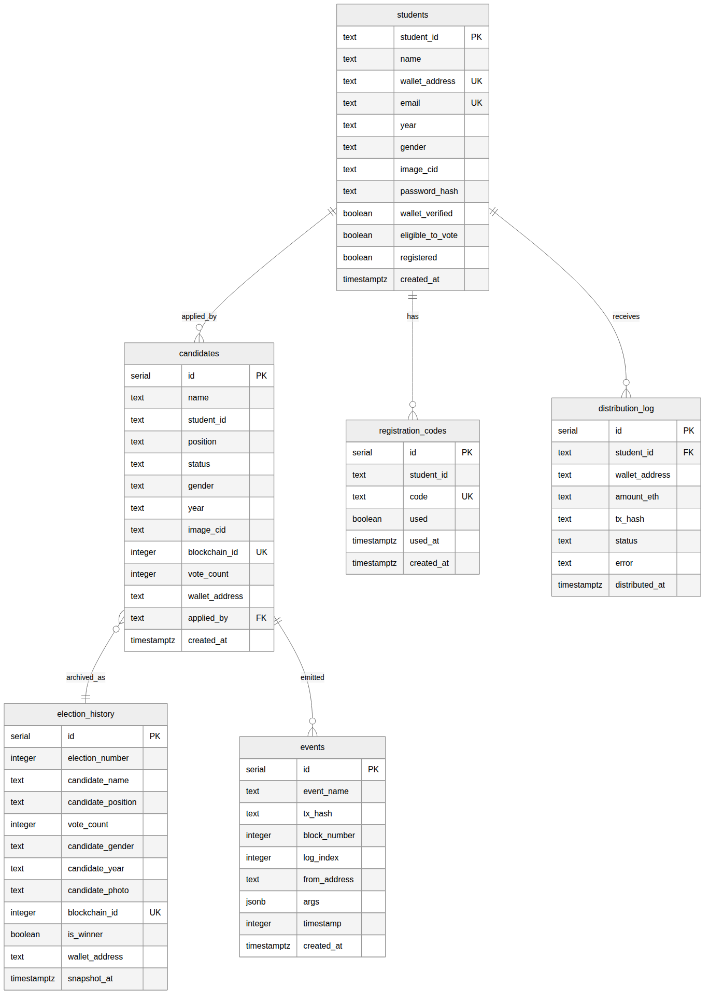
>
> 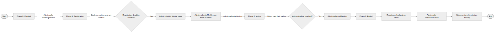
>
> 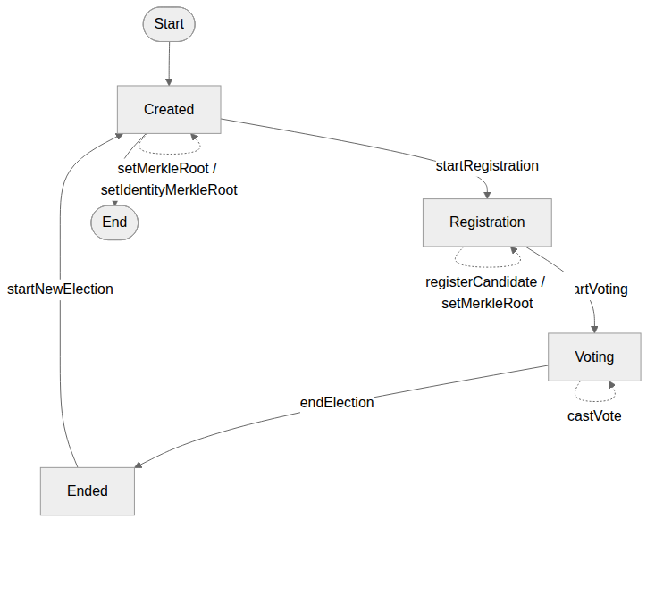
>
> **Full Source**: The complete database schema with all column types and constraints is provided in Appendix D.

### 3.4 Smart Contract Architecture (Election3.sol)

The smart contract is the **central trust anchor** of the entire system. It is deployed on Sepolia testnet and manages all election-critical operations. This section provides a complete, function-by-function examination of the contract.

#### 3.4.1 Contract Overview and Design Philosophy

The contract (`Election3.sol`, 512 lines) is written in Solidity ^0.8.30 and uses OpenZeppelin's `MerkleProof` library for cryptographic verification. The design philosophy follows three principles:

1. **Minimal Trust**: The contract should enforce election rules at the protocol level, not rely on honest behavior from any party. Phase transitions, vote recording, and winner selection are all enforced by contract logic, not by trust in the admin.

2. **Gas Efficiency**: On-chain operations are expensive. The contract uses Merkle trees (storing only 32 bytes instead of thousands of addresses) and batch operations (`castVote()` instead of individual `vote()` calls) to minimize gas costs.

3. **Deterministic Finality**: Given the same inputs (candidates and votes), the contract always produces the same outputs (winners). This determinism ensures that the election outcome is verifiable and cannot be disputed.

#### 3.4.2 Enum Definitions

```solidity
enum Phase { Created, Registration, Voting, Ended }
enum Position { President, Secretary, GeneralMember }
```

**Phase enum**: Represents the four states of the election lifecycle. The contract tracks the current phase via the `phase` state variable. Phase transitions are governed by both function modifiers (`inPhase()`) and explicit `require()` checks.

**Position enum**: Represents the three candidate positions. Position determines ballot placement (President/Secretary/GM sections in `castVote()`), eligibility constraints (year requirements), and winner selection algorithm (President/Secretary use `_findWinner()`, GMs use `_selectGMWinners()`).

#### 3.4.3 Struct Definitions

**Candidate struct** (9 fields):
```solidity
struct Candidate {
    uint256 id;           // On-chain candidate ID (sequential within election)
    string name;          // Full name
    string studentId;     // University student ID (e.g., "GU001")
    uint8 year;           // Academic year (1-4)
    bool isFemale;        // Gender flag for GM diversity algorithm
    string imageCID;      // IPFS CID of candidate photo
    Position position;    // President, Secretary, or GeneralMember
    uint256 voteCount;    // Accumulated votes (incremented by vote() and castVote())
    bool exists;          // Whether this slot is populated (prevents empty slot access)
}
```

The `exists` field is necessary because Solidity mappings return default values (zero) for uninitialized keys. Without the `exists` check, the contract would treat uninitialized candidate slots as valid candidates with zero votes.

**ElectionResult struct** (5 fields):
```solidity
struct ElectionResult {
    uint256 presidentWinnerId;            // Candidate ID of President winner
    uint256 secretaryWinnerId;            // Candidate ID of Secretary winner
    uint256[GENERAL_MEMBERS_ELECTED] generalMemberWinnerIds;  // 5 GM winner IDs
    uint256 totalCandidates;              // Total number of candidates in this election
    uint256 timestamp;                    // Unix timestamp when result was recorded
}
```

A constant `GENERAL_MEMBERS_ELECTED = 5` defines the fixed size of the GM winner array. This is a Solidity best practice — using a constant rather than a magic number improves readability and makes future changes easier.

#### 3.4.4 State Variables

The contract maintains the following state variables:

| Variable | Type | Visibility | Purpose |
|----------|------|------------|---------|
| `admin` | `address` | `public` | Contract owner address (set in constructor) |
| `phase` | `Phase` | `public` | Current election phase |
| `registrationEnd` | `uint256` | `public` | Unix timestamp when registration closes |
| `votingEnd` | `uint256` | `public` | Unix timestamp when voting closes |
| `currentElectionId` | `uint256` | `public` | Monotonically incrementing election counter |
| `voterMerkleRoot` | `bytes32` | `public` | Root of eligible voter address tree |
| `identityMerkleRoot` | `bytes32` | `public` | Root of verified identity attributes tree |
| `regCodeMerkleRoot` | `bytes32` | `public` | Root of registration codes tree |
| `electionCandidateCount` | `mapping(uint256 => uint256)` | `public` | Candidate count per election |
| `candidates` | `mapping(uint256 => mapping(uint256 => Candidate))` | `public` | 2D mapping: [electionId][candidateId] |
| `votedInElection` | `mapping(address => uint256)` | `public` | Last election a voter participated in |
| `candidateRegisteredInElection` | `mapping(address => uint256)` | `public` | Prevents duplicate candidate registration |
| `electionHistory` | `mapping(uint256 => ElectionResult)` | `public` | Archived election results |
| `historyCount` | `uint256` | `public` | Number of historical results stored |

**Storage Slot Analysis**: Each mapping and value occupies a separate storage slot as per the EVM storage layout rules. The three Merkle root values (`voterMerkleRoot`, `identityMerkleRoot`, `regCodeMerkleRoot`) are stored in consecutive slots, allowing gas-efficient batch reads.

#### 3.4.5 Event Definitions

The contract emits eight event types:

```solidity
event CandidateRegistered(uint256 indexed id, address indexed candidate, string name, Position position, string imageCID);
event VoteCast(address indexed voter, uint256 candidateId);
event BallotCast(address indexed voter, uint256 presId, uint256 secId, uint256[] gmIds);
event PhaseChanged(Phase newPhase);
event MerkleRootUpdated(bytes32 newRoot);
event IdentityMerkleRootUpdated(bytes32 newRoot);
event RegCodeMerkleRootUpdated(bytes32 newRoot);
event NewElectionStarted(uint256 indexed electionId);
```

**Event Indexing**: The `indexed` keyword on specific parameters allows efficient filtering. The sync engine uses these indexed parameters to filter events by election ID (`NewElectionStarted(uint256 indexed electionId)`), candidate address (`CandidateRegistered(address indexed candidate)`), and voter address (`VoteCast(address indexed voter)`).

**Event Consumption (Off-Chain)** :
The sync engine consumes all eight events through `contract.queryFilter()`. The events serve as the primary data source for the `events` database table, with each event being persisted to PostgreSQL with its full arguments in JSONB format.

#### 3.4.6 Modifier Definitions

The contract defines two modifiers:

```solidity
modifier onlyAdmin() {
    require(msg.sender == admin, "Not admin");
    _;
}

modifier inPhase(Phase _phase) {
    require(phase == _phase, "Wrong phase");
    _;
}
```

**Modifier Composition**: The modifiers are applied to functions in the standard Solidity pattern, with the modifier placed before the function body. For example, `function endElection() external onlyAdmin inPhase(Phase.Voting)` applies both the admin check and the phase check.

**Gas Cost**: Each modifier adds approximately 200 gas for the `require()` statement and state variable read. This is negligible compared to the overall transaction cost.

#### 3.4.7 Constructor

```solidity
constructor(bytes32 _merkleRoot) {
    admin = msg.sender;
    voterMerkleRoot = _merkleRoot;
    currentElectionId = 1;
    phase = Phase.Created;
}
```

The constructor accepts the initial voter Merkle root as a parameter. This allows the deployer to pre-build the Merkle tree from the initial voter list before deployment. After deployment, additional roots (identity, reg code) are set via their respective setter functions.

**Deployment Flow**:
1. Off-chain: All eligible voter addresses are collected from the database
2. Off-chain: `merkleService.generateMerkleRoot(wallets)` computes the root
3. On-chain: `Election3(voterRoot)` is deployed with the computed root
4. On-chain: `setIdentityMerkleRoot(identityRoot)` is called
5. On-chain: `setRegCodeMerkleRoot(regCodeRoot)` is called

#### 3.4.8 Admin Merkle Root Functions

**`setMerkleRoot(bytes32 _merkleRoot)`** :
- Modifiers: `onlyAdmin`
- Phase check: `require(phase <= Phase.Registration, "Root frozen during voting")`
- Effect: Updates `voterMerkleRoot` and emits `MerkleRootUpdated`
- Rationale: Merkle roots are frozen once voting begins (phase ≥ 2) to prevent the admin from modifying the voter list mid-election

**`setIdentityMerkleRoot(bytes32 _root)`** :
- Same pattern as `setMerkleRoot()`
- Updates `identityMerkleRoot` and emits `IdentityMerkleRootUpdated`

**`setRegCodeMerkleRoot(bytes32 _root)`** :
- Same pattern
- Updates `regCodeMerkleRoot` and emits `RegCodeMerkleRootUpdated`

**`verifyRegCode(string studentId, string code, bytes32[] proof)`** :
- Visibility: `external view` (no state modification, no gas for read-only calls)
- Purpose: Allows the frontend to verify a registration code against the on-chain Merkle root without submitting a transaction
- Leaf construction: `keccak256(abi.encodePacked(studentId, code))`
- Verification: `MerkleProof.verify(proof, regCodeMerkleRoot, leaf)`

**Root Freezing Rationale**: The phase check `<= Phase.Registration` ensures that once the contract enters Voting phase, the Merkle roots are immutable. This prevents the admin from adding or removing voters after voting has started, a critical trust guarantee.

#### 3.4.9 Admin Phase Control Functions

**`startRegistration(uint256 _end)`** :
- Modifiers: `onlyAdmin`
- Preconditions:
  - Phase must be `Created` (not already in progress)
  - `_end` must be in the future (`> block.timestamp`)
- Effects:
  1. Emits `NewElectionStarted(currentElectionId)` — signals a new election cycle
  2. Sets `phase = Phase.Registration`
  3. Sets `registrationEnd = _end`
  4. Emits `PhaseChanged(Phase.Registration)`

**`startVoting(uint256 _end)`** :
- Modifiers: `onlyAdmin`
- Preconditions:
  - Phase must be `Registration`
  - Current time must be past `registrationEnd` (registration period must have ended)
  - `_end` must be in the future
- Effects:
  1. Sets `phase = Phase.Voting`
  2. Sets `votingEnd = _end`
  3. Emits `PhaseChanged(Phase.Voting)`

**`endElection()`** :
- Modifiers: `onlyAdmin inPhase(Phase.Voting)`
- Preconditions:
  - Current time must be past `votingEnd` (voting period must have ended)
- Effects:
  1. Sets `phase = Phase.Ended`
  2. Emits `PhaseChanged(Phase.Ended)`

**`startNewElection()`** :
- Modifiers: `onlyAdmin inPhase(Phase.Ended)`
- Preconditions:
  - At least one candidate must exist (`electionCandidateCount[currentElectionId] > 0`)
- Effects:
  1. Finds President, Secretary, and GM winners (see Section 3.8)
  2. Stores `ElectionResult` in `electionHistory[historyCount]`
  3. Increments `historyCount`
  4. Increments `currentElectionId`
  5. Resets `phase = Phase.Created`
  6. Resets `registrationEnd = 0`, `votingEnd = 0`
  7. Emits `NewElectionStarted(currentElectionId)` with the NEW election ID

**Phase Transition Timeline**:

```
Admin calls startRegistration(t1)  →  Registration active until t1
Admin calls startVoting(t2)        →  Registration must have ended (block.timestamp ≥ t1)
                                     Voting active until t2
Admin calls endElection()          →  Voting must have ended (block.timestamp ≥ t2)
Admin calls startNewElection()     →  Phase resets to Created for next cycle
```

#### 3.4.10 Voter Candidate Registration Function

**`registerCandidate(string _guid, string _name, uint8 _year, bool _isFemale, string _imageCID, Position _position, bytes32[] calldata _proof)`** :

This function allows students to self-register as candidates without admin intermediation, using an identity Merkle proof to verify their attributes.

**Preconditions**:
1. Phase must be `Registration`
2. Current time must be ≤ `registrationEnd`
3. The caller must not have already registered in this election (`candidateRegisteredInElection[msg.sender] != currentElectionId`)

**Merkle Proof Verification**:
```solidity
bytes32 leaf = keccak256(abi.encodePacked(msg.sender, _name, _year, _isFemale));
require(MerkleProof.verify(_proof, identityMerkleRoot, leaf), "Identity not verified");
```

This verifies that the caller's wallet address combined with their claimed name, year, and gender matches a leaf in the admin-verified identity Merkle tree. An imposter cannot register with fake attributes because they cannot produce a valid Merkle proof for a leaf containing a different address.

**Position Eligibility Constraints**:
```solidity
if (_position == Position.President) {
    require(_year == 4, "President must be 4th year");
} else if (_position == Position.Secretary) {
    require(_year >= 3 && _year <= 4, "Secretary must be 3rd or 4th year");
}
// General Members: no year restriction
```

**Candidate Storage**:
```solidity
electionCandidateCount[currentElectionId]++;
uint256 id = electionCandidateCount[currentElectionId];
candidates[currentElectionId][id] = Candidate({...});
candidateRegisteredInElection[msg.sender] = currentElectionId;
emit CandidateRegistered(id, msg.sender, _name, _position, _imageCID);
```

The candidate ID is auto-incremented per election. The `candidateRegisteredInElection` mapping prevents the same wallet from registering multiple candidates.

#### 3.4.11 Single-Candidate Vote Function

**`vote(uint256 _candidateId, bytes32[] calldata _proof)`** :

This is a legacy function retained for backward compatibility. The primary voting path uses `castVote()`.

**Preconditions**:
1. Phase must be `Voting`
2. Current time must be ≤ `votingEnd`
3. Voter must not have voted in the current election
4. The target candidate must exist

**Merkle Proof Verification**:
```solidity
bytes32 leaf = keccak256(abi.encodePacked(msg.sender));
require(MerkleProof.verify(_proof, voterMerkleRoot, leaf), "Not eligible voter");
```

**Vote Recording**:
```solidity
votedInElection[msg.sender] = currentElectionId;
candidates[currentElectionId][_candidateId].voteCount++;
emit VoteCast(msg.sender, _candidateId);
```

#### 3.4.12 Multi-Position Ballot Function (Primary Voting Path)

**`castVote(uint256 _presidentId, uint256 _secretaryId, uint256[] calldata _gmIds, bytes32[] calldata _proof)`** :

This is the primary voting function, supporting a full multi-position ballot in a single transaction. It replaces up to 7 individual `vote()` calls, saving significant gas.

**Preconditions** (shared):
1. Phase must be `Voting`
2. Current time must be ≤ `votingEnd`
3. Voter must not have voted in the current election
4. Merkle proof must verify against `voterMerkleRoot`

**President Vote** (optional):
```solidity
if (_presidentId > 0) {
    Candidate storage pres = candidates[currentElectionId][_presidentId];
    require(pres.exists && pres.position == Position.President, "Invalid president");
    pres.voteCount++;
    emit VoteCast(msg.sender, _presidentId);
    votedCount++;
}
```

The president ID of 0 means "abstain" — the voter can choose not to vote for president.

**Secretary Vote** (optional):
```solidity
if (_secretaryId > 0) {
    Candidate storage sec = candidates[currentElectionId][_secretaryId];
    require(sec.exists && sec.position == Position.Secretary, "Invalid secretary");
    sec.voteCount++;
    emit VoteCast(msg.sender, _secretaryId);
    votedCount++;
}
```

**General Member Votes** (up to 5, with gender validation):
```solidity
require(_gmIds.length <= GENERAL_MEMBERS_ELECTED, "Too many GM votes");  // Max 5
uint256 femaleCount;
for (uint256 i = 0; i < _gmIds.length; i++) {
    uint256 gid = _gmIds[i];
    require(gid > 0, "Invalid GM ID");
    Candidate storage gm = candidates[currentElectionId][gid];
    require(gm.exists && gm.position == Position.GeneralMember, "Invalid GM");
    if (gm.isFemale) femaleCount++;
    gm.voteCount++;
    emit VoteCast(msg.sender, gid);
    votedCount++;
}
if (_gmIds.length > 0) {
    require(femaleCount >= 2, "Need at least 2 female GM votes");
}
```

**Gender Validation**: The contract counts female GM selections in the loop and enforces the minimum of 2 at the end. This check occurs on-chain and cannot be bypassed by the frontend.

**Final Validation**:
```solidity
require(votedCount > 0, "No candidates selected");
votedInElection[msg.sender] = currentElectionId;
emit BallotCast(msg.sender, _presidentId, _secretaryId, _gmIds);
```

The voter must select at least one candidate across all positions. The `votedInElection` mapping is set after recording all votes, ensuring atomicity.

**Gas Comparison**:

| Method | Votes Cast | Gas Cost | Gas per Vote |
|--------|-----------|----------|-------------|
| 7 × `vote()` | 7 | ~350,000 | ~50,000 |
| 1 × `castVote()` (7 candidates) | 7 | ~250,000 | ~35,714 |
| **Savings** | | **~100,000 gas (28.6%)** | |

#### 3.4.13 Winner Determination Functions

**`startNewElection()`** (Admin):

This function is the final step of an election cycle. It computes winners, archives the result, and resets for the next election.

**Pre-winner Validation**:
```solidity
require(electionCandidateCount[currentElectionId] > 0, "No candidates");
```

**GM Candidate Validation**:
```solidity
if (gmCount > 0) {
    require(gmCount >= GENERAL_MEMBERS_ELECTED, "Need at least 5 GM candidates");
    require(femaleGMCount >= 2, "Need at least 2 female GM candidates");
}
```

These checks ensure there are enough GM candidates (≥5) and female GM candidates (≥2) to hold a valid election.

**Winner Selection**:
```solidity
uint256 presWinner = _findWinner(Position.President);
uint256 secWinner = _findWinner(Position.Secretary);
uint256[GENERAL_MEMBERS_ELECTED] memory gmWinners = _selectGMWinners();
```

**Result Archival**:
```solidity
electionHistory[historyCount] = ElectionResult({
    presidentWinnerId: presWinner,
    secretaryWinnerId: secWinner,
    generalMemberWinnerIds: gmWinners,
    totalCandidates: electionCandidateCount[currentElectionId],
    timestamp: block.timestamp
});
historyCount++;
currentElectionId++;
phase = Phase.Created;
registrationEnd = 0;
votingEnd = 0;
emit NewElectionStarted(currentElectionId);
```

**`_findWinner(Position _position)`** (Private):

```solidity
function _findWinner(Position _position) private view returns (uint256 winnerId) {
    uint256 maxVotes;
    uint256 ec = electionCandidateCount[currentElectionId];
    for (uint256 i = 1; i <= ec; i++) {
        Candidate storage c = candidates[currentElectionId][i];
        if (!c.exists || c.position != _position) continue;
        if (c.voteCount > maxVotes || (c.voteCount == maxVotes && (winnerId == 0 || c.id < winnerId))) {
            maxVotes = c.voteCount;
            winnerId = c.id;
        }
    }
    return winnerId;
}
```

**Algorithm**: Simple linear scan. For each candidate matching the desired position, compare vote count against the current maximum. Tie-breaking rule: lower candidate ID wins (earliest registrant).

**`_selectGMWinners()`** (Private):

```solidity
function _selectGMWinners() private view returns (uint256[GENERAL_MEMBERS_ELECTED] memory winners) {
    uint256 count;
    uint256 ec = electionCandidateCount[currentElectionId];

    // Pass 1: Select top 2 female GM candidates
    for (uint256 f = 0; f < 2; f++) {
        uint256 bestId; uint256 bestVotes;
        for (uint256 i = 1; i <= ec; i++) {
            Candidate storage c = candidates[currentElectionId][i];
            if (!c.exists || c.position != Position.GeneralMember || !c.isFemale) continue;
            bool already;
            for (uint256 j = 0; j < count; j++) {
                if (winners[j] == c.id) { already = true; break; }
            }
            if (already) continue;
            if (c.voteCount > bestVotes || (c.voteCount == bestVotes && (bestId == 0 || c.id < bestId))) {
                bestVotes = c.voteCount; bestId = c.id;
            }
        }
        if (bestId != 0) winners[count++] = bestId;
    }

    // Pass 2: Select top 3 remaining GM candidates (any gender)
    for (uint256 r = 0; r < 3; r++) {
        uint256 bestId; uint256 bestVotes;
        for (uint256 i = 1; i <= electionCandidateCount[currentElectionId]; i++) {
            Candidate storage c = candidates[currentElectionId][i];
            if (!c.exists || c.position != Position.GeneralMember) continue;
            bool already;
            for (uint256 j = 0; j < count; j++) {
                if (winners[j] == c.id) { already = true; break; }
            }
            if (already) continue;
            if (c.voteCount > bestVotes || (c.voteCount == bestVotes && (bestId == 0 || c.id < bestId))) {
                bestVotes = c.voteCount; bestId = c.id;
            }
        }
        if (bestId != 0) winners[count++] = bestId;
    }
}
```

**Algorithm Complexity**: O(N × K) where N is the number of GM candidates and K is the total winners to select (5). For Pass 1, the outer loop runs 2 times (selecting 2 females), and the inner loop scans all candidates each time. For Pass 2, the outer loop runs 3 times (selecting 3 remaining), with the same inner scan. Total complexity: O(5N).

**Diversity Guarantee**: The two-pass design mathematically guarantees:
- If ≥2 female GM candidates exist AND they rank among the top vote-getters → they are selected
- If ≥2 female GM candidates exist but fewer than 2 are in the top vote-getters → top 2 females are still selected in Pass 1, and the remaining top candidates fill Pass 2
- If <2 female GM candidates exist → the transaction reverts (election cannot proceed)

#### 3.4.14 View Functions

**`getCandidate(uint256 _id)`** :
- Returns the `Candidate` struct for the current election
- Equivalent to `candidates[currentElectionId][_id]`

**`getHistoricalCandidate(uint256 _electionId, uint256 _candidateId)`** :
- Returns candidate data from any past election
- Essential for the sync engine's `backfillElectionHistory()` function

**`candidateCount()`** :
- Returns `electionCandidateCount[currentElectionId]`
- Used by the sync engine's state polling subsystem

**`getPhase()`** :
- Returns the current `Phase` enum value
- The most frequently called view function (called every 10 seconds by the sync engine)

**`hasVoted(address _voter)`** :
- Returns `votedInElection[_voter] == currentElectionId`
- Used by the frontend to display voting status

**`getElectionResult(uint256 _index)`** :
- Returns the `ElectionResult` struct for a historical election
- Used by the sync engine's `snapshotResults()` and `backfillElectionHistory()` functions

> **Figures**: Smart contract class structure, phase state machine, and winner determination algorithm.
>
> 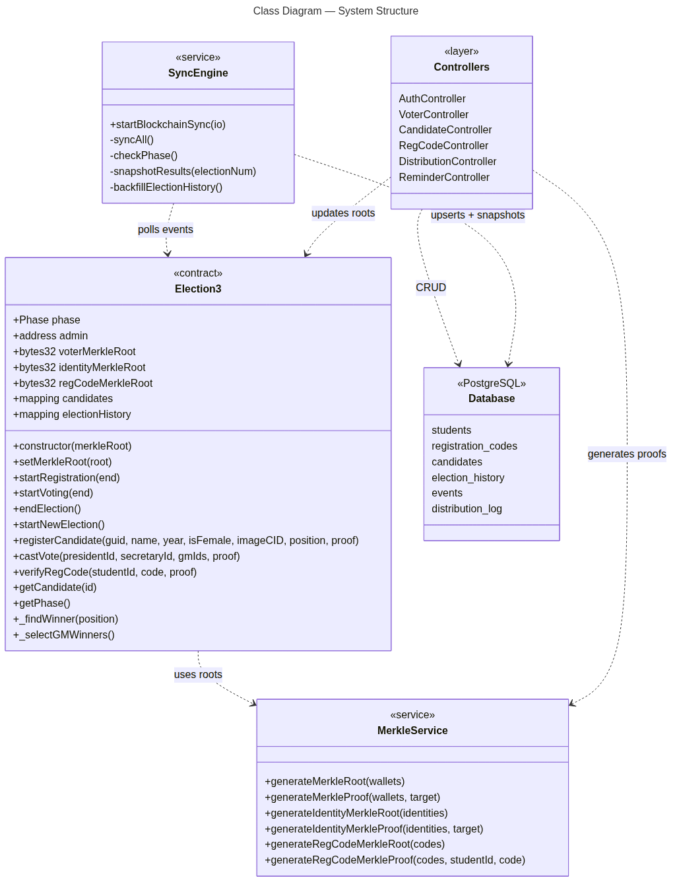
>
> 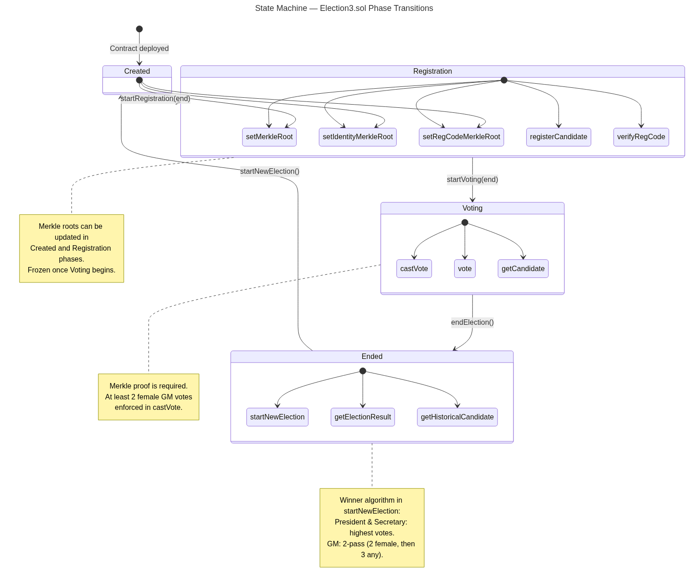
>
> 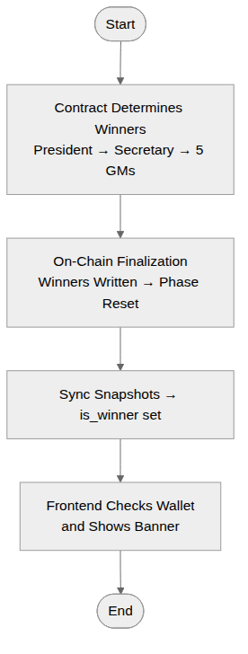
>
> 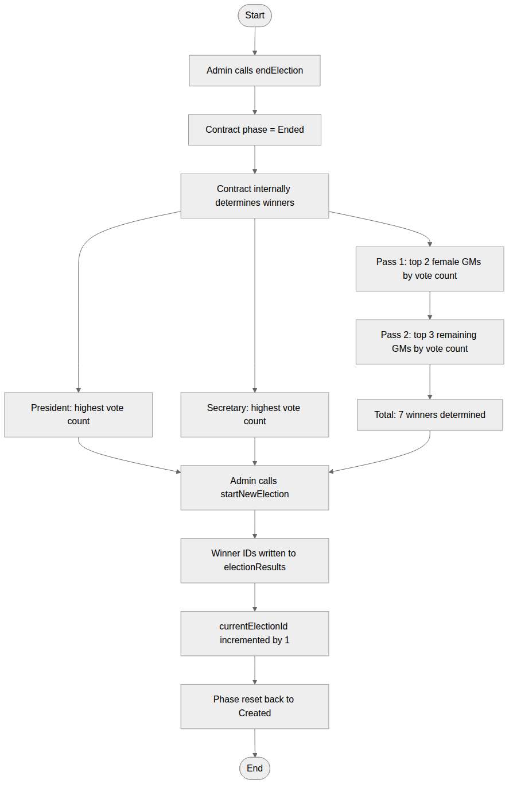
>
> **Full Source**: The complete Election3.sol contract is provided in Appendix B.

### 3.5 Merkle Tree System

The Merkle tree system is the cryptographic foundation of the voting system, enabling gas-efficient, trustless verification of voter eligibility, candidate identity, and registration code validity.

#### 3.5.1 Merkle Tree Fundamentals

A Merkle tree is a binary tree where each leaf node contains a hash of a data element, and each internal node contains the hash of its two child nodes concatenated. The root hash (Merkle root) uniquely represents the entire data set.

Key properties exploited by this system:

1. **Efficient Verification**: A data element's membership in a set can be proven with O(log N) hashes, where N is the set size. For 1,000 voters, only 10 hashes are needed.

2. **Tamper Evidence**: Changing any leaf changes the root. The root is stored immutably on-chain, so any tampering is immediately detectable.

3. **Deterministic Construction**: With `sortPairs: true`, the tree construction is deterministic regardless of insertion order. The same set of leaves always produces the same root.

#### 3.5.2 Voter Eligibility Tree (Address-Only)

**Purpose**: Proves that a wallet address is authorized to vote in the election.

**Leaf Construction (Off-Chain — merkleService.js)** :
```javascript
const leaf = keccak256(ethers.solidityPacked(
    ["address"],
    [ethers.getAddress(addr)]
));
```

**Leaf Construction (On-Chain — Election3.sol)** :
```solidity
bytes32 leaf = keccak256(abi.encodePacked(msg.sender));
```

**Source Data**: All students with `eligible_to_vote = true` in the `students` table.

**Root Function**:
```javascript
export function generateMerkleRoot(wallets) {
    if (!wallets || wallets.length === 0) return ethers.ZeroHash;
    const leaves = wallets.map(addr => 
        keccak256(ethers.solidityPacked(["address"], [ethers.getAddress(addr)]))
    );
    const tree = new MerkleTree(leaves, keccak256, { sortPairs: true });
    return tree.getHexRoot();
}
```

**Proof Function**:
```javascript
export function generateMerkleProof(allWallets, targetWallet) {
    const leaves = allWallets.map(addr => 
        keccak256(ethers.solidityPacked(["address"], [ethers.getAddress(addr)]))
    );
    const tree = new MerkleTree(leaves, keccak256, { sortPairs: true });
    const leaf = keccak256(ethers.solidityPacked(["address"], [ethers.getAddress(targetWallet)]));
    return tree.getHexProof(leaf);
}
```

**Address Checksumming**: The `ethers.getAddress(addr)` call ensures addresses are checksummed (EIP-55) before hashing. This prevents case-sensitivity mismatches between the off-chain leaf and the on-chain `msg.sender`.

**Used By**: `vote()` and `castVote()` in the contract — both functions call `MerkleProof.verify(_proof, voterMerkleRoot, keccak256(abi.encodePacked(msg.sender)))`.

#### 3.5.3 Identity Merkle Tree (Rich Identity)

**Purpose**: Proves that a voter's identity attributes (name, academic year, gender) have been verified by the admin and are associated with their wallet address.

**Leaf Construction (Off-Chain)** :
```javascript
const leaf = keccak256(ethers.solidityPacked(
    ["address", "string", "uint8", "bool"],
    [ethers.getAddress(id.address), id.name, id.year, id.isFemale]
));
```

**Leaf Construction (On-Chain)** :
```solidity
bytes32 leaf = keccak256(abi.encodePacked(msg.sender, _name, _year, _isFemale));
```

**Source Data**: All eligible students with `{wallet, name, year, gender}` from the `students` table. Gender `"female"` maps to `isFemale = true`.

**Rationale for Including Attributes**: By hashing the identity attributes into the leaf, the contract can verify not just that the voter exists, but that their specific attributes (name, year, gender) match what the admin verified. This prevents a student from registering as a candidate with false attributes (e.g., claiming to be a 4th-year when they are 2nd-year to run for President).

**Used By**: `registerCandidate()` in the contract.

#### 3.5.4 Registration Code Merkle Tree

**Purpose**: Proves that a student possesses a valid, one-time registration code without requiring the contract to store each code individually.

**Code Format**: `XXXX-XXXX-XXXX` (12 uppercase alphanumeric characters with hyphens)

**Normalization**: Before hashing, the code is normalized by removing dashes and uppercasing:
```javascript
function normalizeCode(code) {
    return code.replace(/-/g, "").toUpperCase();
}
```

**Leaf Construction (Off-Chain)** :
```javascript
const leaf = keccak256(ethers.solidityPacked(
    ["string", "string"],
    [student_id, normalizeCode(code)]
));
```

**Leaf Construction (On-Chain)** :
```solidity
bytes32 leaf = keccak256(abi.encodePacked(studentId, code));
```

Note: The on-chain verification uses the raw `code` parameter (not normalized), because the frontend should pass the normalized code. The off-chain proof generation normalizes before hashing.

**Source Data**: All unexpired, unused registration codes from the `registration_codes` table.

**Used By**: `verifyRegCode()` view function — called by the frontend before allowing student portal registration.

#### 3.5.5 Tree Rebuild Mechanism

The Merkle trees are rebuilt (new root computed and submitted to the contract) in these scenarios:

**1. Admin Bulk Verification** (`voterController.bulkVerifyVoters()`):
- Admin selects students to verify
- Backend sets `eligible_to_vote = true` for selected students
- Backend queries all eligible wallets from DB
- Backend calls `rebuildMerkleTrees()`
- New Voter and Identity roots are submitted to the contract via `setMerkleRoot()` and `setIdentityMerkleRoot()`
- Transaction is rolled back if either root submission fails

**2. Admin Revocation** (`voterController.revokeVoter()`):
- Similar to verification but removes a student from `eligible_to_vote`
- Merkle trees are rebuilt without the revoked student

**3. Manual Rebuild** (`voterController.adminRebuildMerkle()`):
- Admin can trigger a rebuild at any time (during Created or Registration phases)

**4. Auto-Rebuild on Phase Transition** (sync engine `checkPhase()`):
- When the sync engine detects a phase transition to Voting (phase 2), it automatically calls `rebuildMerkleTrees()`
- This ensures the Merkle roots reflect the latest voter list before voting begins
- Roots are frozen during Voting — no further changes allowed

**5. Registration Code Rebuild** (`registrationCodeController.rebuildRegCodeMerkleRoot()`):
- Triggered after generating new codes or marking codes as used
- Rebuilds only the `regCodeMerkleRoot`, not the voter/identity trees

**Root Freezing Check in Contract**:
```solidity
function setMerkleRoot(bytes32 _merkleRoot) external onlyAdmin {
    require(phase <= Phase.Registration, "Root frozen during voting");
    // ...
}
```

All three root setters include this check, ensuring roots cannot be modified once voting starts.

#### 3.5.6 Proof Acquisition Flow (End-to-End)

```
Voter → Frontend: "I want to vote"
Frontend → Backend: GET /api/voters/proof?wallet=<address>
Backend:
  1. Query all eligible wallets: SELECT LOWER(wallet_address) FROM students WHERE eligible_to_vote = true AND wallet_address IS NOT NULL
  2. Build Merkle tree from wallets
  3. Generate proof for target wallet
  4. Return proof as JSON hex array
Frontend:
  5. Receive proof array
  6. Call contract.castVote(..., proof)
Contract:
  7. Compute leaf = keccak256(abi.encodePacked(msg.sender))
  8. Call MerkleProof.verify(proof, voterMerkleRoot, leaf)
   9. If true → record vote; if false → revert
```

> **Figures**: Merkle proof flow and the full lifecycle of all three Merkle trees.
>
> 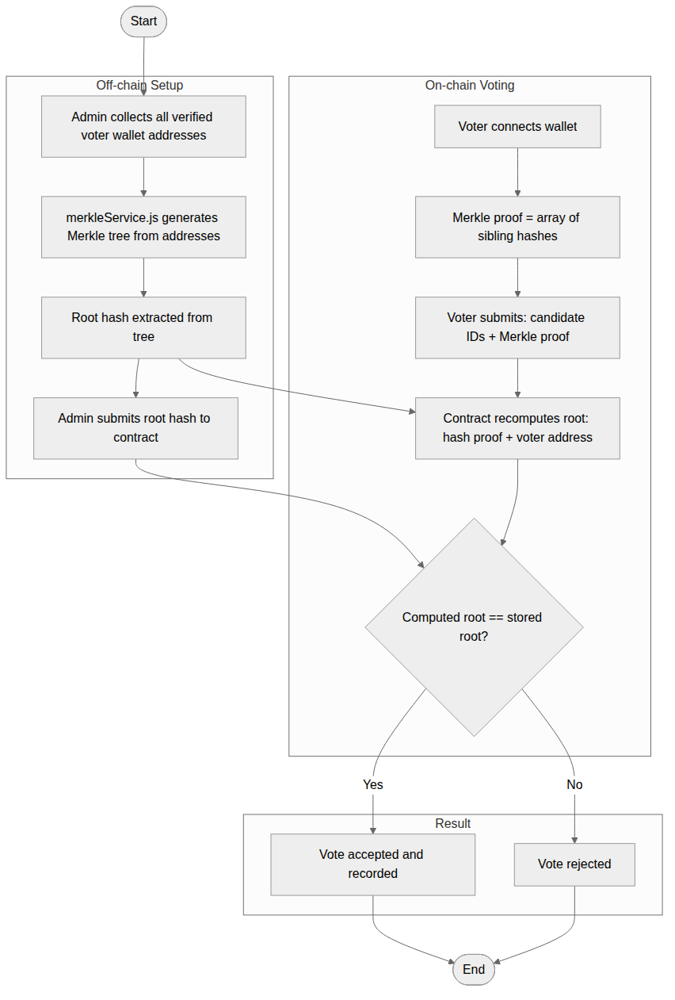
>
> 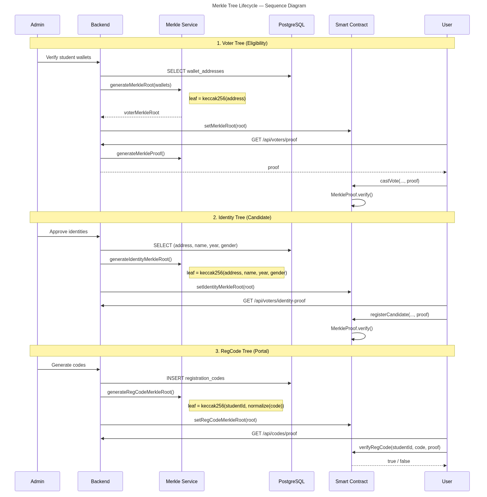

### 3.6 Sync Engine

The sync engine is the bridge between the blockchain and the database. It runs continuously in the background, polling the Sepolia network for new events and updating the PostgreSQL database accordingly. It also handles state detection, phase change monitoring, and snapshot operations.

#### 3.6.1 Engine Architecture

The sync engine runs two parallel intervals, both at `POLL_MS = 10000` (10 seconds):

```javascript
setInterval(syncAll, POLL_MS);     // Event polling + state detection
setInterval(checkPhase, POLL_MS);  // Phase change detection
```

**Global State Variables**:

| Variable | Type | Purpose |
|----------|------|---------|
| `processedKeys` | `Set<string>` | Tracks processed events by `{txHash}-{logIndex}` |
| `lastProcessedBlock` | `number` | Last block scanned for events |
| `prevVotes` | `Object<string, number>` | Cached vote counts for change detection |
| `prevPhase` | `number|null` | Last known phase value |
| `prevElectionId` | `number` | Last known election ID |
| `prevCandidateCount` | `number` | Last known candidate count |
| `minCandidateId` | `number` | Minimum candidate ID to process (increases after new election) |
| `snapshotInProgress` | `boolean` | Prevents concurrent snapshot operations |
| `lastSnapshotElectionNum` | `number|null` | Last election number for which snapshot was taken |

#### 3.6.2 Event Polling Subsystem (`fetchAndEmitOnChainEvents`)

This subsystem queries the contract for events within the block range `[lastProcessedBlock, currentBlock]` and processes each event type.

**Block Range Batching**:

```javascript
const MAX_BLOCK_RANGE = 10; // Alchemy free tier limit

async function queryLogsBatched(filter, fromBlock, toBlock) {
    const allLogs = [];
    const step = MAX_BLOCK_RANGE;
    for (let start = fromBlock; start <= toBlock; start += step) {
        const end = Math.min(start + step - 1, toBlock);
        const logs = await electionContractV3.queryFilter(filter, start, end);
        allLogs.push(...logs);
    }
    return allLogs;
}
```

Batching is required because Alchemy's free tier limits `eth_getLogs` queries to block ranges of 10. Without batching, queries spanning large block ranges would fail with "query returned more than 10000 results" or "block range too large" errors.

**Event Processing Pipeline**:

For each event type, the engine:

1. Queries logs using batched `queryFilter`
2. Checks `processedKeys` for deduplication
3. If new: adds to `processedKeys`, persists to `events` table via `addEvent()`, performs type-specific processing

**CandidateRegistered Event Processing**:
```javascript
// For each CandidateRegistered log:
const cand = await electionContractV3.getCandidate(candId);
if (cand.exists) {
    await db.query(
        `INSERT INTO candidates (blockchain_id, name, position, vote_count, year, gender, image_cid, status, wallet_address)
         VALUES ($1, $2, $3, $4, $5, $6, $7, 'approved', $8)
         ON CONFLICT (blockchain_id) WHERE blockchain_id IS NOT NULL
         DO UPDATE SET name = $2, position = $3, vote_count = $4, wallet_address = $8, ...`,
        [id, cand.name, position, voteCount, year, gender, imageCID, walletAddress]
    );
}
```

The `ON CONFLICT ... DO UPDATE` clause ensures idempotency — if the candidate was already inserted by a previous poll cycle, the record is updated rather than duplicated.

**VoteCast Event Processing**:
```javascript
// For each VoteCast log:
await db.query(
    `UPDATE candidates SET vote_count = vote_count + 1 WHERE blockchain_id = $1`,
    [candidateId]
);
prevVotes[candidateId] = (prevVotes[candidateId] || 0) + 1;
```

Vote counting uses an atomic `UPDATE ... SET vote_count = vote_count + 1` to prevent race conditions. The `prevVotes` cache is updated for change detection in the state polling subsystem.

**PhaseChanged Event Processing**:
```javascript
// Persist event for audit trail
await emitEvent({ eventName: "PhaseChanged", ... });
```

No database state change — phase is tracked in the `checkPhase()` subsystem.

**NewElectionStarted Event Processing**:
```javascript
// Trigger snapshot of the just-ended election
const prevElectionNum = eid - 1;
await snapshotResults(prevElectionNum);
await db.query("DELETE FROM candidates");
minCandidateId = totalCandidates + 1;
```

The snapshot saves all current candidates to `election_history` before the candidates table is cleared for the new election.

**MerkleRootUpdated and IdentityMerkleRootUpdated Event Processing**:
```javascript
await emitEvent({ eventName: "MerkleRootUpdated", ... });
// Emit to frontend via Socket.IO for dashboard display
if (io) io.emit("blockchainEvent", event);
```

No database state change — these events are primarily for the real-time dashboard.

#### 3.6.3 State Polling Subsystem (`syncAll`)

Acts as a **fallback detection mechanism** when events are missed due to:
- RPC endpoint temporary unavailability
- Block range query limits
- Race conditions between event emission and polling

```javascript
async function syncAll() {
    if (snapshotInProgress) return; // Prevent concurrent access

    await fetchAndEmitOnChainEvents(); // Try event-driven first

    const cc = Number(await electionContractV3.candidateCount());
    let anyChange = false;

    for (let i = minCandidateId; i <= cc; i++) {
        const cand = await electionContractV3.getCandidate(i);
        if (!cand.exists) continue;

        const id = Number(cand.id);
        const onChainVotes = Number(cand.voteCount);
        const isNew = !(id in prevVotes);
        const prev = prevVotes[id] || 0;

        await upsertCandidate(cand); // Update DB regardless

        if (onChainVotes !== prev) {
            await db.query(`UPDATE candidates SET vote_count = $1 WHERE blockchain_id = $2`,
                [onChainVotes, id]);
            prevVotes[id] = onChainVotes;
            anyChange = true;
        }
    }

    if (anyChange) broadcastResults();
}
```

**Key Design**: The state polling directly reads `getCandidate(i).voteCount` on-chain and compares against `prevVotes` cache. If a vote was cast but the event was missed (e.g., RPC outage during the event log query), the state poll catches the discrepancy and updates the database.

#### 3.6.4 Phase Detection Subsystem (`checkPhase`)

Monitors the contract's phase and election ID for transitions:

```javascript
async function checkPhase() {
    const phase = Number(await electionContractV3.getPhase());
    const eid = Number(await electionContractV3.currentElectionId());

    const newElectionDetected =
        (prevPhase !== null && prevPhase === 3 && phase === 0) ||
        (prevElectionId > 0 && eid > prevElectionId);

    if (newElectionDetected) {
        const prevElectionNum = eid - 1;
        if (lastSnapshotElectionNum !== prevElectionNum) {
            await snapshotResults(prevElectionNum);
            await db.query("DELETE FROM candidates");
            minCandidateId = totalCandidates + 1;
            prevVotes = {};
            prevCandidateCount = 0;
        }
    }

    if (lastPolledPhase !== phase) {
        // Snapshot when election ends (phase 3)
        if (phase === 3 && prevElectionId > 0 && !snapshotInProgress) {
            await snapshotResults(prevElectionId);
        }
        // Auto-rebuild Merkle trees when entering Voting phase
        if (phase === 2) {
            await rebuildMerkleTrees();
        }
        lastPolledPhase = phase;
    }
}
```

**Phase Transition Detection Logic**:

| Detected Transition | Condition | Action |
|--------------------|-----------|--------|
| New Election | `prevPhase === 3 && phase === 0` OR `eid > prevElectionId` | Snapshot results, clear candidates, reset vote cache |
| Voting Started | `phase === 2` (first detected) | Auto-rebuild Merkle trees |
| Election Ended | `phase === 3` (first detected) | Final snapshot of results |

#### 3.6.5 Snapshot Mechanism (`snapshotResults`)

When an election ends, the snapshot mechanism archives all candidate data to the `election_history` table for permanent storage.

**Flow**:
1. Check if snapshot already exists for this election number (idempotency)
2. Read winners from contract: `electionContractV3.getElectionResult(electionNum - 1)`
3. Read all candidates from the `candidates` table
4. For each candidate:
   - Determine if they are a winner by checking against contract's winner IDs
   - Insert into `election_history` with `is_winner` flag
   - Use `ON CONFLICT DO NOTHING` to handle duplicate runs
5. Backfill any winners that exist on-chain but are missing from the DB cache

**Winner Position Mapping**:
```javascript
const winnerPositions = new Map();
const result = await electionContractV3.getElectionResult(electionNum - 1);
winnerPositions.set(Number(result.presidentWinnerId), "President");
winnerPositions.set(Number(result.secretaryWinnerId), "Secretary");
for (const gid of result.generalMemberWinnerIds) {
    if (gid !== 0) winnerPositions.set(Number(gid), "General Member");
}
```

#### 3.6.6 Backfill Mechanism (`backfillElectionHistory`)

On engine startup, this function ensures all past election results are recorded in the database:

```javascript
async function backfillElectionHistory() {
    const contractCount = Number(await electionContractV3.historyCount());
    for (let i = 0; i < contractCount; i++) {
        const electionNum = i + 1;
        const r = await electionContractV3.getElectionResult(i);
        
        // Mark winners in existing records
        await markWinner(Number(r.presidentWinnerId), "President");
        await markWinner(Number(r.secretaryWinnerId), "Secretary");
        for (const gid of r.generalMemberWinnerIds) {
            await markWinner(Number(gid), "General Member");
        }
    }
}
```

The `markWinner()` helper handles three cases:
1. **Existing record with matching `blockchain_id`** → Update `is_winner = true`
2. **Existing record with matching `name + position` but different `blockchain_id`** → Update `is_winner = true` and `blockchain_id`
3. **No existing record** → Insert new record with all data from contract

This comprehensive approach ensures the `election_history` table is always a complete and accurate archive.

#### 3.6.7 Initialization Sequence

On engine startup, the following sequence executes:

1. Read current phase, election ID, and candidate count from contract
2. Get latest block number from provider
3. Handle stale database state:
   - If phase is Created but candidates exist in DB → snapshot them as leftover from previous run
   - If phase is Created and no candidates → new election, set `minCandidateId` appropriately
4. Sync all existing candidates from contract to DB (populate `prevVotes` cache)
5. Broadcast initial results to connected clients
6. Seed historical events from DB data
7. Backfill election history from contract archive

```javascript
// Startup log output example:
// ✅ Initial sync — 12 candidates, 347 votes, phase 2
// 📦 Startup: snapshotted 8 leftover candidates to election #3
// 🧹 Cleaned 5 stale VoteCast events from old contracts
```

#### 3.6.8 Deduplication Mechanism

Event deduplication is handled through two complementary mechanisms:

**1. `processedKeys` Set**:
```javascript
const processedKeys = new Set();
// ...
const key = `${log.transactionHash}-${log.index}`;
if (processedKeys.has(key)) continue;
processedKeys.add(key);
```

This prevents the same event from being processed twice within a single engine session. The set grows unboundedly with the number of events, but this is acceptable because:
- Events are appended at ~1 per second maximum (one vote per second)
- A session running for 24 hours would accumulate ~86,400 keys
- Each key is approximately 100 bytes → ~8.6 MB total, well within Node.js memory limits

**2. Idempotent Database Operations**:
```javascript
// INSERT ... ON CONFLICT DO UPDATE (upsert)
// UPDATE candidates SET vote_count = vote_count + 1 (additive, not absolute)
// ON CONFLICT DO NOTHING (for snapshot inserts)
```

Even if `processedKeys` is cleared (server restart), duplicate processing does not corrupt data because all database operations are idempotent.

> **Figures**: Sync engine architecture, subsystems, and sequence interaction.
>
> 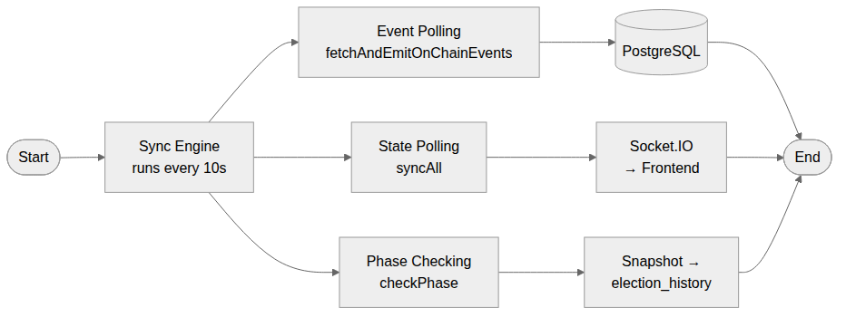
>
> 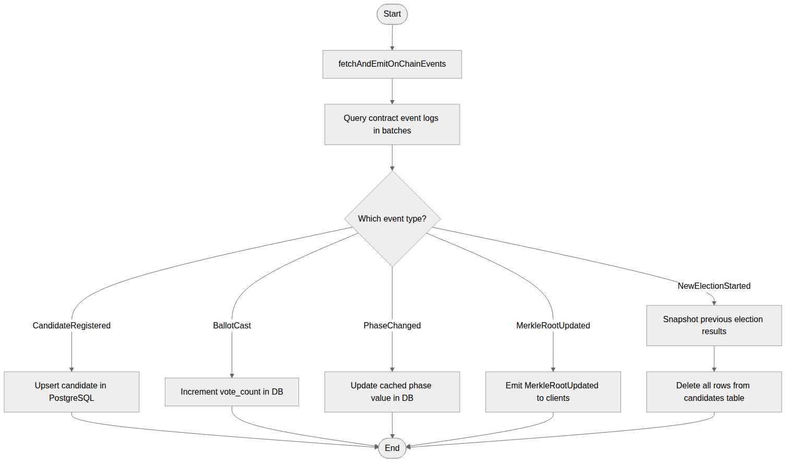
>
> 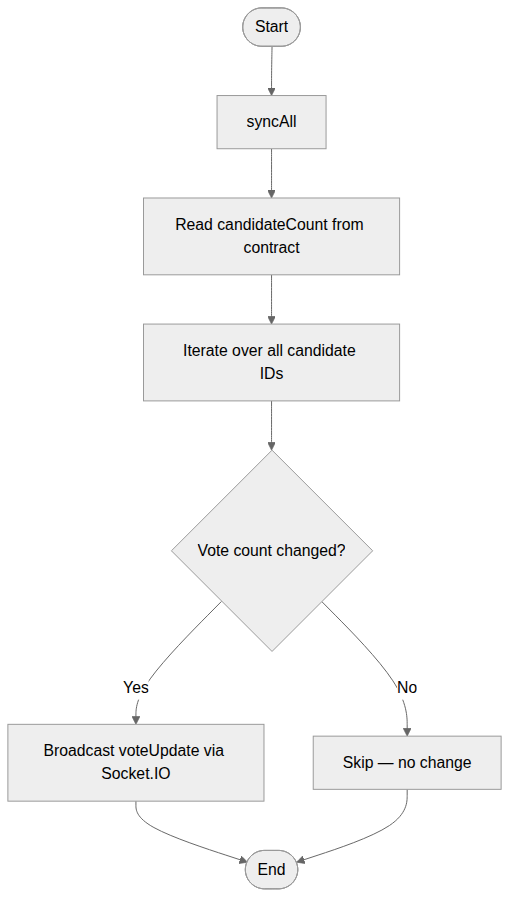
>
> 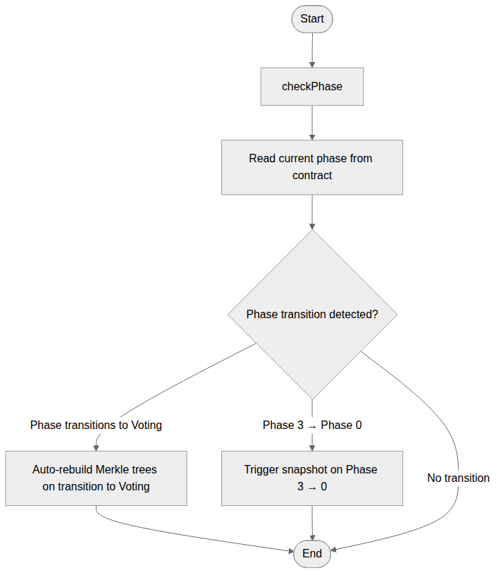
>
> 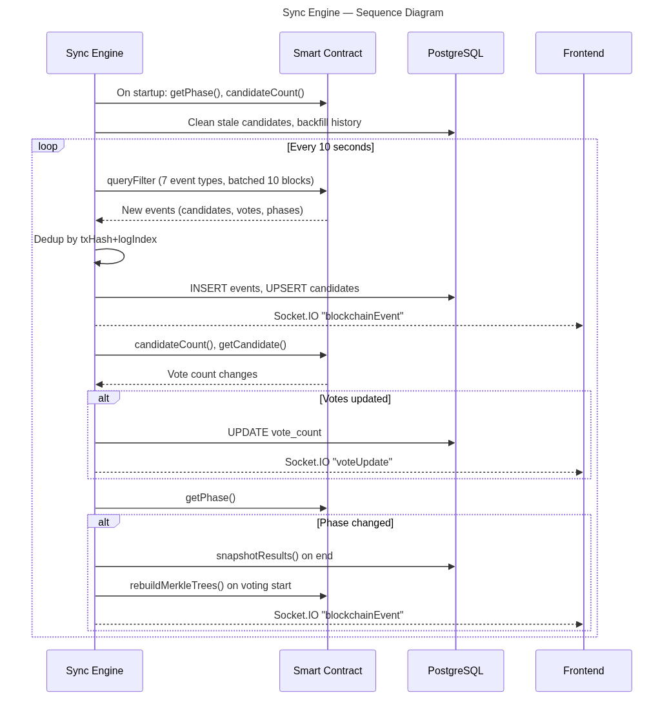

### 3.7 Registration Code System

The registration code system controls access to the student portal. Each eligible student receives a unique, one-time code that must be presented during registration. The code is verified on-chain via Merkle proof before the student can create an account.

#### 3.7.1 Code Generation

**`generateCode()`** (Internal helper):

```javascript
function generateCode() {
    const chars = "ABCDEFGHIJKLMNOPQRSTUVWXYZ0123456789";
    function segment() {
        let s = "";
        for (let i = 0; i < 4; i++) s += chars[Math.floor(Math.random() * chars.length)];
        return s;
    }
    return `${segment()}-${segment()}-${segment()}`;
}
```

**Format**: `XXXX-XXXX-XXXX` where X is uppercase alphanumeric (A-Z, 0-9).

**Entropy**: 36^12 = 4.7 × 10^18 possible codes. This is sufficient to prevent brute-force guessing.

**`generateCodes()`** (Controller):

The admin-facing code generation endpoint:

1. Admin specifies students (by student_id array) and optional parameters
2. For each student:
   a. Generate a unique code (checking against existing codes to avoid collisions)
   b. Insert into `registration_codes` table with `student_id`, `code`, `used = false`
3. Rebuild the registration code Merkle root:
   a. Query all unused codes from the database
   b. Call `merkleService.generateRegCodeMerkleRoot(allCodes)`
   c. Submit new root to contract via `setRegCodeMerkleRoot()`

#### 3.7.2 Code Distribution

Codes are distributed through two channels:

**1. Email Distribution** (`sendCodesEmail()`):

```javascript
// For each student with a code:
await transporter.sendMail({
    to: student.email,
    subject: "Your Registration Code for the Student Voting Portal",
    html: `<p>Dear ${student.name},</p>
           <p>Your registration code is: <strong>${code}</strong></p>
           <p>Visit the voting portal to complete your registration.</p>`
});
```

The email service uses Nodemailer with SMTP configuration from environment variables (`EMAIL_HOST`, `EMAIL_USER`, `EMAIL_PASS`).

**2. In-Person Distribution** (Optional):

Codes can be printed or distributed through administrative channels for students without email access.

#### 3.7.3 Code Verification Flow

**Step 1: Frontend requests proof**

```
Frontend → Backend: GET /api/codes/proof?student_id=GU001&code=ABCD-EFGH-IJKL
```

**Step 2: Backend generates proof**

The `getRegCodeProof()` controller:
1. Queries all unused codes from the database
2. Builds a Merkle tree from all code pairs
3. Generates proof for the specific `{student_id, code}` pair
4. Returns the proof array to the frontend

**Step 3: Frontend verifies proof on-chain**

```javascript
const contract = await getContractV3();
const isValid = await contract.verifyRegCode(studentId, normalizedCode, proof);
```

The `verifyRegCode()` view function:
```solidity
function verifyRegCode(string calldata studentId, string calldata code, bytes32[] calldata proof)
    external view returns (bool)
{
    bytes32 leaf = keccak256(abi.encodePacked(studentId, code));
    return MerkleProof.verify(proof, regCodeMerkleRoot, leaf);
}
```

Since `verifyRegCode()` is a `view` function, it does not require gas and returns immediately.

**Step 4: Complete registration**

If the proof verifies, the student proceeds to register:
- Backend marks the code as `used = true` in the database
- Student's `registered` field is set to `true`
- Student can now log in to the portal

#### 3.7.4 Code Lifecycle

```
Generated (unused) → Distributed (unused) → Presented for registration (used) → (optional) Regenerated if lost
```

**States**:
- `used = false`: Code is valid and unclaimed
- `used = true`: Code has been consumed; cannot be reused
- **No expiration**: Codes do not have an expiration timestamp (they remain valid until used)

**Merkle Tree Update on Code Usage**:
When a code is used, the registration code Merkle root should be rebuilt to exclude the used code from the tree. However, since `verifyRegCode()` is only used during registration (before account creation), and the frontend should have already received the proof before the code is marked used, this is not strictly necessary for security. The rebuild on code generation is the critical update.

> **Figures**: Voter registration and candidate self-registration flows.
>
> 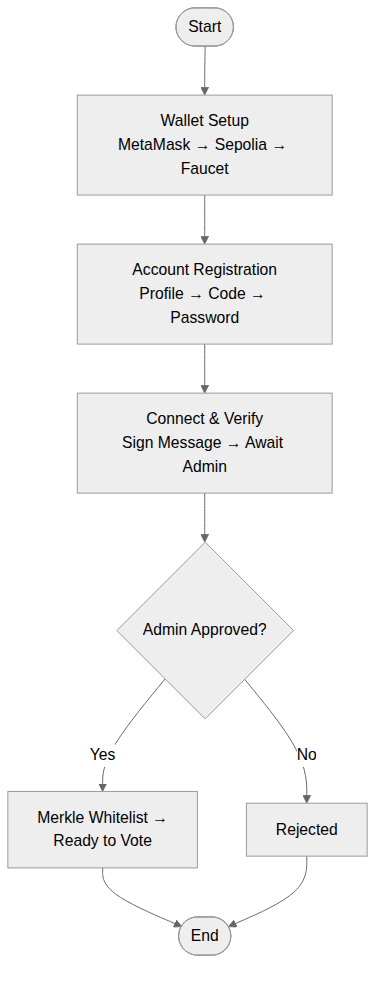
>
> 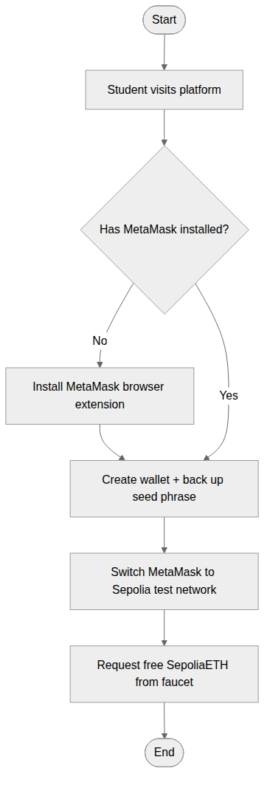
>
> 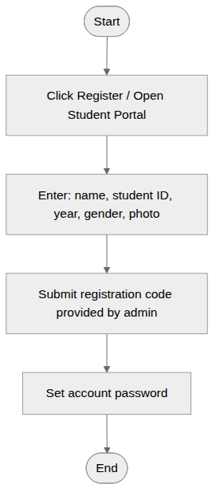
>
> 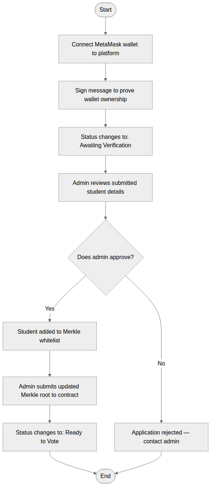
>
> 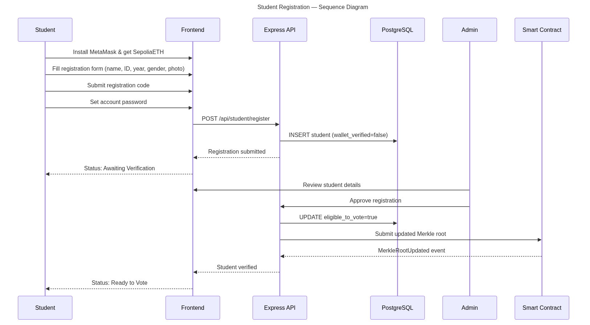
>
> 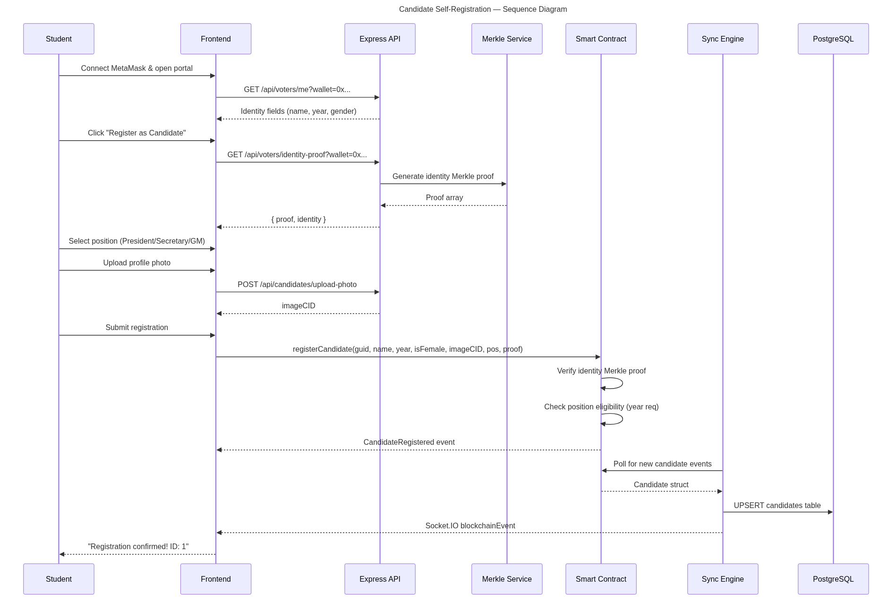

### 3.8 REST API Complete Reference

This section documents every endpoint in the 12 route modules, including HTTP method, path, authentication requirements, request parameters, and response format.

#### 3.8.1 Authentication Routes (`/api/auth`)

| Method | Path | Auth | Description |
|--------|------|------|-------------|
| POST | `/verify-code` | None | Verify a registration code frontend |
| POST | `/register` | None | Register a new student account |
| POST | `/login` | None | Authenticate student (returns JWT) |
| GET | `/me` | JWT | Get current student's profile |
| PATCH | `/me` | JWT | Update current student's profile |
| POST | `/change-password` | JWT | Change password |
| POST | `/forgot-password` | None | Send password reset email |
| POST | `/me/photo` | JWT | Upload profile photo |
| GET | `/admin/students` | JWT+Admin | List all students |
| PATCH | `/admin/students/:id` | JWT+Admin | Update any student |
| POST | `/admin/students/batch-upsert` | JWT+Admin | Batch create/update students |

#### 3.8.2 Student Routes (`/api/students`)

| Method | Path | Auth | Description |
|--------|------|------|-------------|
| POST | `/` | JWT+Admin | Create a student |
| GET | `/` | JWT+Admin | Get paginated students |
| GET | `/all` | JWT+Admin | Get all students |
| DELETE | `/:student_id` | JWT+Admin | Delete a student |

#### 3.8.3 Candidate Routes (`/api/candidates`)

| Method | Path | Auth | Description |
|--------|------|------|-------------|
| GET | `/` | None | List all candidates |
| GET | `/pending` | JWT+Admin | List pending candidates |
| GET | `/by-wallet/:wallet` | None | Get candidate by wallet address |
| POST | `/apply` | JWT | Submit candidate application |
| GET | `/me` | JWT | Get own candidate status |
| POST | `/:id/approve` | JWT+Admin | Approve a candidate |
| POST | `/:id/reject` | JWT+Admin | Reject a candidate |
| POST | `/upload-photo` | JWT | Upload candidate photo |

#### 3.8.4 Voter Routes (`/api/voters`)

| Method | Path | Auth | Description |
|--------|------|------|-------------|
| GET | `/me` | None | Get own voter status (by wallet query param) |
| GET | `/pending` | JWT+Admin | List pending verifications |
| GET | `/proof` | None | Get Merkle proof for voting |
| GET | `/identity-proof` | None | Get Merkle proof for candidate registration |
| POST | `/verify-bulk` | JWT+Admin | Bulk verify voters |
| POST | `/revoke` | JWT+Admin | Revoke voter eligibility |
| POST | `/rebuild-merkle` | JWT+Admin | Force rebuild Merkle trees |

#### 3.8.5 Results Routes (`/api/results`)

| Method | Path | Auth | Description |
|--------|------|------|-------------|
| GET | `/` | None | Get live results |
| GET | `/stats` | None | Get aggregated statistics |
| GET | `/history` | None | Get election history |
| POST | `/import-old-history` | JWT+Admin | Import from old contract |

#### 3.8.6 Wallet Routes (`/api/wallet`)

| Method | Path | Auth | Description |
|--------|------|------|-------------|
| POST | `/verify` | None | Verify wallet ownership via signed message |

#### 3.8.7 Registration Code Routes (`/api/admin`)

| Method | Path | Auth | Description |
|--------|------|------|-------------|
| POST | `/generate-codes` | JWT+Admin | Generate new codes |
| GET | `/codes` | JWT+Admin | List all codes |
| POST | `/upload-codes` | JWT+Admin | Upload codes via CSV/XLSX |
| GET | `/regcode-merkle-root` | JWT+Admin | Get current Merkle root |
| POST | `/rebuild-regcode-merkle-root` | JWT+Admin | Rebuild Merkle root |
| POST | `/send-codes` | JWT+Admin | Email codes to students |

#### 3.8.8 Code Routes (`/api/codes`)

| Method | Path | Auth | Description |
|--------|------|------|-------------|
| GET | `/proof` | None | Get Merkle proof for code verification |

#### 3.8.9 Distribution Routes (`/api/distribution`)

| Method | Path | Auth | Description |
|--------|------|------|-------------|
| GET | `/stats` | None | Get distribution statistics |
| GET | `/summary` | JWT+Admin | Get distribution summary |
| GET | `/history` | JWT+Admin | Get distribution log |
| POST | `/send` | JWT+Admin | Send Sepolia ETH to a student |
| POST | `/retry` | JWT+Admin | Retry failed distribution |

#### 3.8.10 Event Routes (`/api/events`)

| Method | Path | Auth | Description |
|--------|------|------|-------------|
| GET | `/` | None | Get recent events (paginated) |

#### 3.8.11 Contract Routes (`/api/contract`)

| Method | Path | Auth | Description |
|--------|------|------|-------------|
| GET | `/phase` | None | Get current phase and deadlines |

#### 3.8.12 Reminder Routes (`/api/admin`)

| Method | Path | Auth | Description |
|--------|------|------|-------------|
| GET | `/reminder-config` | JWT+Admin | Get reminder configuration |
| POST | `/reminder-config` | JWT+Admin | Update reminder configuration |
| POST | `/send-reminders` | JWT+Admin | Trigger reminder emails |
| GET | `/pending-codes` | JWT+Admin | Get pending code stats |

#### 3.8.13 Authentication Middleware

The JWT authentication middleware (`middleware/auth.js`) validates the `Authorization: Bearer <token>` header:

```javascript
export function requireStudentAuth(req, res, next) {
    const authHeader = req.headers.authorization || "";
    const match = authHeader.match(/^Bearer\s+(.+)$/i);
    if (!match) return res.status(401).json({ error: "Missing or malformed Authorization header" });
    
    const token = match[1];
    try {
        const decoded = jwt.verify(token, config.jwtSecret);
        req.user = { student_id: decoded.student_id, name: decoded.name };
        next();
    } catch (err) {
        return res.status(401).json({ error: "Invalid or expired token" });
    }
}
```

The JWT payload contains `{ student_id, name }` and is signed with the server's JWT secret. Tokens expire after a configurable duration (default: 24 hours).

> **Figures**: Admin operations sequence showing phase management, voter verification, and code generation flows.
>
> 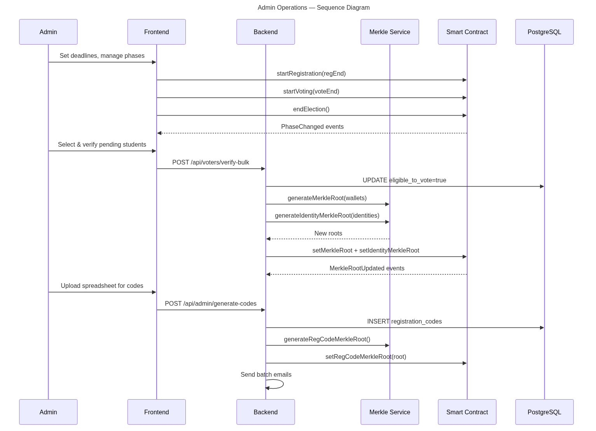

### 3.9 Socket.IO Real-Time Communication

The Socket.IO server enables real-time bidirectional communication between the backend and frontend clients.

#### 3.9.1 Events Emitted (Server → Client)

| Event | Payload | Trigger |
|-------|---------|---------|
| `voteUpdate` | `[{id, name, position, vote_count}]` | Any vote count change detected by sync engine |
| `blockchainEvent` | `{eventName, args, txHash, blockNumber}` | Any on-chain event detected |
| `PhaseChanged` | `{newPhase: number}` | Phase transition detected |
| `dataChanged` | `{type: string}` | Merkle root update or data refresh |

**`voteUpdate` payload structure**:
```json
{
  "event": "voteUpdate",
  "data": [
    { "id": 1, "name": "Alice", "position": "President", "vote_count": 42 },
    { "id": 2, "name": "Bob", "position": "President", "vote_count": 38 }
  ]
}
```

The payload is a complete snapshot of all candidates ordered by vote count descending. This allows the frontend to replace its entire candidate list rather than incrementally updating, reducing complexity.

#### 3.9.2 Events Received (Client → Server)

| Event | Payload | Purpose |
|-------|---------|---------|
| `requestVoteUpdate` | (none) | New client requests current vote data |

When a client connects, it typically emits `requestVoteUpdate` to receive the current vote state. The server responds by calling `broadcastResults()`, which sends the latest data.

#### 3.9.3 Connection Lifecycle

```
Client connects:
1. HTTP polling transport established
2. Upgrade to WebSocket (if available)
3. Server logs: "Real-time dashboard client connected: <socket.id>"
4. Client may emit requestVoteUpdate
5. Server responds with current state
6. Bidirectional communication established
7. On disconnect: server logs disconnect (or no-op)
```

**Transport fallback**: The Socket.IO client starts with `transports: ["polling", "websocket"]`, which means it first establishes an HTTP long-polling connection, then attempts to upgrade to WebSocket. If WebSocket fails (firewall, proxy), it falls back to HTTP long-polling.

**Auto-reconnection**: Socket.IO client automatically attempts to reconnect with exponential backoff if the connection drops.

#### 3.9.4 Broadcast on Vote Update

The `broadcastResults()` function queries the database and emits to all connected clients:

```javascript
async function broadcastResults() {
    if (!io) return;
    const result = await db.query(
        "SELECT blockchain_id as id, name, position, vote_count FROM candidates ORDER BY vote_count DESC"
    );
    io.emit("voteUpdate", result.rows);
}
```

The `io.emit()` call broadcasts to ALL connected clients (no room filtering). This is appropriate for the current single-election use case, but could be optimized with room-based broadcasting for multi-election scenarios.

### 3.10 Security Model

The security model encompasses authentication, authorization, cryptographic verification, and operational security measures.

#### 3.10.1 Authentication Mechanisms

| Layer | Mechanism | Strength | Bypass Risk |
|-------|-----------|----------|-------------|
| Blockchain | MetaMask wallet signature | ECDSA on secp256k1, 2^128 security | Wallet private key compromise |
| Web App | JWT with bcrypt password | bcrypt cost factor 10, 256-bit JWT secret | Password brute force (mitigated by rate limiting) |
| Registration | Merkle proof + one-time code | 36^12 code entropy + on-chain verification | Code interception (mitigated by email encryption) |

**Wallet Signature Verification** (`walletController.js`):

```javascript
const recovered = ethers.verifyMessage(message, signature);
if (recovered.toLowerCase() !== walletAddress.toLowerCase()) {
    return res.status(401).json({ error: "Signature does not match wallet address" });
}
```

The `verifyMessage()` function recovers the signer's address from the signature. If the recovered address matches the claimed wallet address, the user has proven ownership of the wallet's private key.

#### 3.10.2 Authorization Model

**Role Hierarchy**:
```
Admin (contract owner)
  └── Full access to all admin endpoints
      └── JWT-Authenticated Students
            └── Own profile only
                └── Unauthenticated Users
                      └── Read-only public endpoints
```

**Admin Identification**:
The admin is identified by comparing their connected wallet address against `contract.admin()`. This is performed in the `AuthContext` and in admin middleware checks:

```javascript
const adminAddress = await contract.admin();
const isAdmin = address.toLowerCase() === adminAddress.toLowerCase();
```

#### 3.10.3 Rate Limiting

Rate limiting is applied to authentication endpoints:

```javascript
const authLimiter = rateLimit({
    windowMs: 15 * 60 * 1000,   // 15 minutes
    max: 20,                      // 20 requests
    message: { error: "Too many requests — try again later." },
});

app.use("/api/auth/login", authLimiter);
app.use("/api/auth/register", authLimiter);
```

This prevents brute-force attacks on login and registration. 20 requests per 15 minutes is sufficient for legitimate use (a single user might log in 2-3 times in a session) while preventing rapid-fire attacks.

#### 3.10.4 HTTP Security Headers (Helmet)

The Helmet middleware sets the following security headers:

| Header | Value | Purpose |
|--------|-------|---------|
| `Content-Security-Policy` | Default Helmet | Prevents XSS and data injection |
| `X-Content-Type-Options` | `nosniff` | Prevents MIME type sniffing |
| `X-Frame-Options` | `SAMEORIGIN` | Prevents clickjacking |
| `Strict-Transport-Security` | `max-age=15552000` | Enforces HTTPS |
| `Cross-Origin-Resource-Policy` | `cross-origin` | Allows cross-origin image loading |

The `crossOriginResourcePolicy: { policy: "cross-origin" }` override is necessary because the frontend may host uploaded images (profile photos) that need to be accessed cross-origin.

#### 3.10.5 CORS Protection

CORS is configured to allow specific origins:

```javascript
const origins = config.corsOrigin === "*"
    ? "*"
    : config.corsOrigin.split(",").map(s => s.trim());

app.use(cors({ origin: origins, credentials: true }));
```

In production, `CORS_ORIGIN` should be set to the frontend's domain (e.g., `https://voting.example.com`), preventing unauthorized websites from making API calls to the backend.

#### 3.10.6 Contract-Level Security

**Modifier Protection**:
- `onlyAdmin`: Sensitive functions (phase control, Merkle root updates) are protected by this modifier
- `inPhase()`: Functions can only be called in the correct phase

**Merkle Proof Verification**:
All voting and candidate registration functions require valid Merkle proofs. The contract:
1. Recomputes the leaf from the caller's data (`msg.sender`, attributes)
2. Verifies against the stored root using `MerkleProof.verify()`
3. Reverts if verification fails

**Double-Vote Prevention**:
```solidity
require(votedInElection[msg.sender] != currentElectionId, "Already voted");
```

Each wallet can vote only once per election. The `votedInElection` mapping resets per election (stored as election ID, not boolean).

**Phase Transition Checks**:
```solidity
require(block.timestamp >= votingEnd, "Voting period not over");
```

The admin cannot call `endElection()` before the voting period has ended, preventing premature vote closure.

#### 3.10.7 Database-Level Security

**SQL Injection Prevention**:
All database queries use parameterized statements:
```javascript
await db.query("UPDATE candidates SET vote_count = $1 WHERE blockchain_id = $2", [onChainVotes, id]);
```

User-supplied values are passed as parameters, never concatenated into SQL strings.

**Password Hashing**:
Passwords are hashed using bcrypt with a cost factor of 10:
```javascript
const bcrypt = require("bcrypt");
const hash = await bcrypt.hash(password, 10);
const match = await bcrypt.compare(password, hash);
```

### 3.11 Data Flow: End-to-End Vote Casting

This section traces a complete vote casting operation through every system component.

#### Step-by-Step Flow

**Phase 1: Preconditions**
1. Smart contract is in `Voting` phase
2. Voter's wallet is connected to the frontend
3. Voter has been verified (admin set `eligible_to_vote = true`)
4. Voter has not already voted in this election

**Phase 2: Proof Acquisition (Frontend → Backend)**
1. `VotingPanelV3.jsx` renders candidate grid with President, Secretary, and GM sections
2. Voter selects candidates
3. Frontend validates gender requirement (≥2 female GMs) client-side
4. Before submitting, frontend fetches Merkle proof:
   ```javascript
   const response = await fetch(`${API_URL}/api/voters/proof?wallet=${wallet}`);
   const { proof } = await response.json();
   ```

**Phase 3: Backend Proof Generation**
1. `voterController.getProof()` queries all eligible wallets:
   ```sql
   SELECT LOWER(wallet_address) FROM students 
   WHERE eligible_to_vote = true AND wallet_address IS NOT NULL
   ```
2. Calls `merkleService.generateMerkleProof(allWallets, targetWallet)`
3. Returns proof array as JSON

**Phase 4: Transaction Submission (Frontend → MetaMask → Contract)**
1. Frontend calls `castVote()` on the contract:
   ```javascript
   const contract = await getContractV3();
   const tx = await contract.castVote(presidentId, secretaryId, gmIds, proof);
   ```
2. MetaMask opens confirmation popup showing transaction details (gas estimate, network, contract interaction)
3. User confirms in MetaMask
4. MetaMask signs the transaction with the user's private key
5. Transaction is broadcast to the Sepolia network via the connected RPC provider
6. Transaction enters the mempool, pending inclusion in a block

**Phase 5: On-Chain Processing**
1. Transaction is included in a block (typically 12-15 seconds on Sepolia)
2. Contract executes `castVote()`:
   - Verifies Merkle proof
   - Checks phase and deadline
   - Checks duplicate vote prevention
   - Validates each candidate (exists, correct position)
   - Counts female GM votes, validates ≥2
   - Increments vote counts
   - Sets `votedInElection[msg.sender]`
   - Emits `BallotCast` and `VoteCast` events

**Phase 6: Event Detection (Sync Engine)**
1. Sync engine polls at 10-second intervals
2. `fetchAndEmitOnChainEvents()` detects `VoteCast` event in block range `[lastProcessedBlock, currentBlock]`
3. Deduplication check: `processedKeys` does not contain `{txHash}-{logIndex}`
4. Event is persisted to the `events` table
5. `vote_count` is incremented in the `candidates` table:
   ```sql
   UPDATE candidates SET vote_count = vote_count + 1 WHERE blockchain_id = $1
   ```
6. `prevVotes[candidateId]` is updated

**Phase 7: State Polling (Fallback)**
1. `syncAll()` iterates over `[1..candidateCount]`
2. Reads `getCandidate(i).voteCount` on-chain
3. Compares against `prevVotes[i]` cache
4. If discrepancy found (e.g., event was missed): updates DB directly

**Phase 8: Real-Time Broadcast (Backend → Frontend)**
1. `broadcastResults()` queries all candidates from DB:
   ```sql
   SELECT blockchain_id as id, name, position, vote_count FROM candidates ORDER BY vote_count DESC
   ```
2. `io.emit("voteUpdate", result.rows)` broadcasts to all connected clients
3. Frontend `Socket.IO` client receives the event
4. `Results.jsx` re-renders with updated vote counts
5. User sees their vote reflected in the live results

**Total Latency Breakdown**:

| Phase | Component | Typical Duration |
|-------|-----------|------------------|
| 2-3 (Proof Acquisition) | Frontend ↔ Backend | 50-200ms |
| 4 (Transaction Submission) | Frontend → MetaMask | User-dependent (2-10s) |
| 5 (Block Confirmation) | Sepolia Network | 12-15s |
| 6 (Event Detection) | Sync Engine | 0-10s (polling interval) |
| 8 (Broadcast) | Socket.IO | 50-100ms |
| **Total** | **End to End** | **~15-35s** |

> **Figures**: Ballot casting and winner selection flows.
>
> 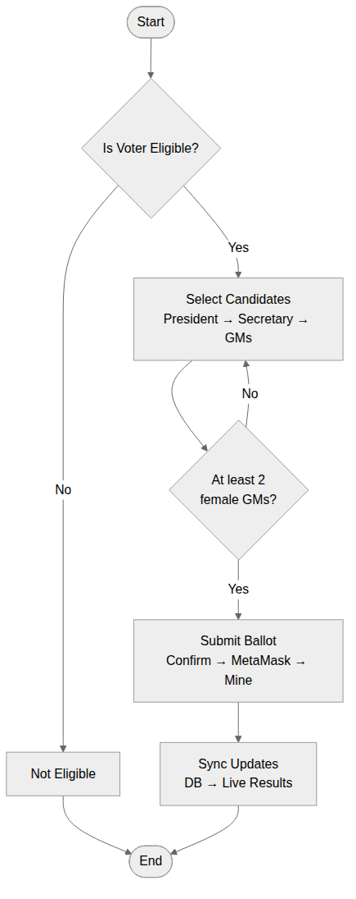
>
> 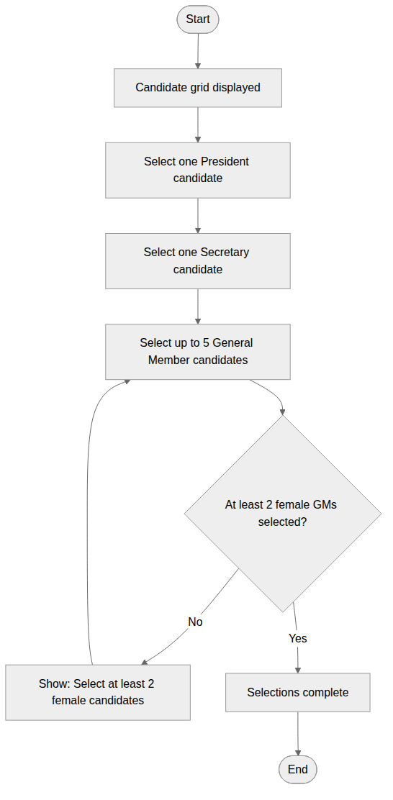
>
> 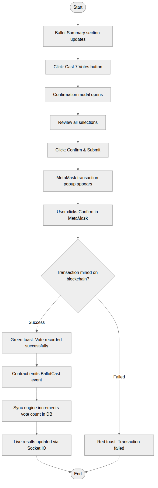
>
> 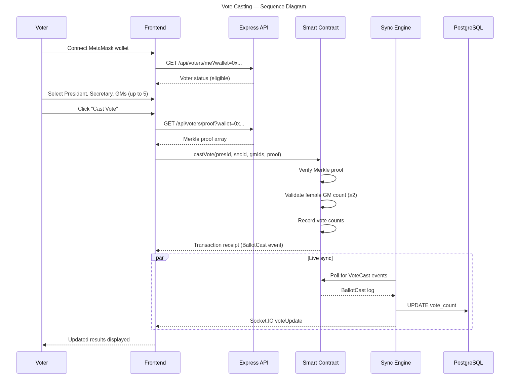
>
> 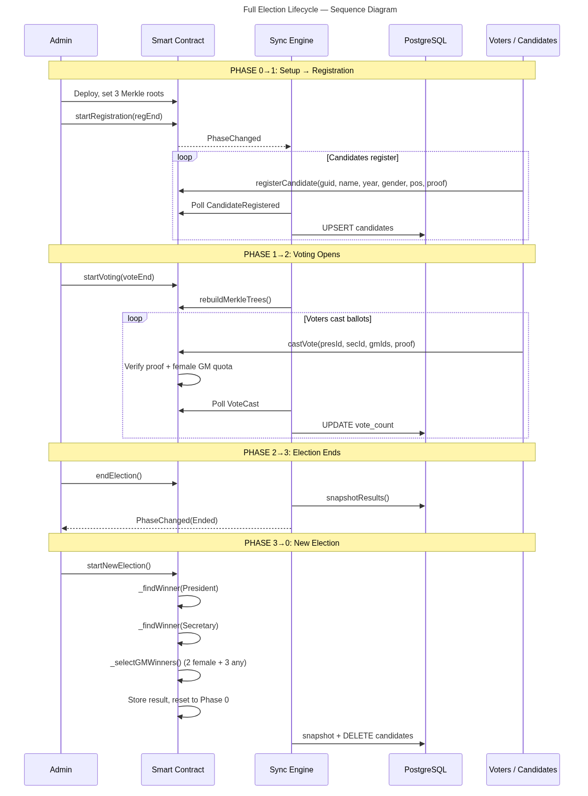
>
> 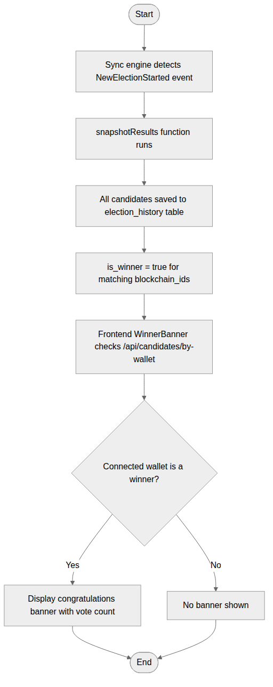

### 3.12 Ethical Considerations

The system was designed and implemented with the following ethical principles.

#### 3.12.1 Transparency and Verifiability

Every vote is recorded as an immutable event on a public blockchain. Any voter can:
- Look up their transaction hash on Etherscan to verify it was processed
- Read the `VoteCast` event to confirm their candidate received the vote
- Independently compute the Merkle root from the public voter list and verify it matches the stored root

This level of transparency exceeds traditional voting systems where voters must trust election officials to count votes correctly.

#### 3.12.2 Gender Inclusivity

The two-pass General Member winner algorithm encodes gender diversity requirements directly into the smart contract. This ensures:
- At least 2 women are elected as General Members in every election
- This requirement cannot be bypassed by administrative action or procedural manipulation
- The remaining seats are filled based on merit (vote count)

The algorithm is transparent and verifiable — any stakeholder can read the contract code and confirm the fairness mechanism.

#### 3.12.3 Privacy and Data Protection

The system employs several privacy-protecting measures:
- **Pseudonymity**: Voters are identified by wallet addresses on-chain, not real-world identities
- **Data Minimization**: Only cryptographic hashes are stored on-chain; personal data (names, emails, photos) remains in the backend database
- **Access Control**: Profile data is protected by JWT authentication
- **Consent**: Users must explicitly connect their MetaMask wallet and sign messages to prove ownership

**Limitation**: The system does not implement zero-knowledge voting. Ballots are publicly visible on-chain. While voter identities are pseudonymous (wallet addresses), sophisticated analysis could potentially link wallets to real-world identities. Zero-knowledge proofs (zk-SNARKs) could address this but were outside the scope of this implementation.

#### 3.12.4 Fair Access

The registration code system ensures that only eligible students can participate. Codes are:
- Generated by the admin and distributed through established communication channels (email, in-person)
- Unique per student (one code per student_id)
- One-time use (code is invalidated after successful registration)
- Verified on-chain via Merkle proof (cannot be forged)

#### 3.12.5 Institutional Oversight

The system was designed in consultation with faculty advisors and IT administrators. Smart contract code was reviewed for common vulnerabilities (reentrancy, overflow, access control). The deployment on Sepolia testnet ensures that any undiscovered vulnerabilities do not affect real assets.

#### 3.12.6 Informed Consent

Users connecting their MetaMask wallet are explicitly prompted to sign a message, confirming they understand that their wallet address will be associated with their vote on the public blockchain. The frontend displays appropriate warnings and confirmation dialogs before each transaction.

### 3.13 Research Limitations

The following limitations are acknowledged and should be considered when interpreting the research findings:

**L1: Testnet Dependency**
The system is deployed on Sepolia testnet, which relies on faucet-issued test ETH. While this eliminates gas costs for users, it introduces dependency on faucet availability and rate limits. Mainnet deployment would require real ETH for gas, potentially affecting participation rates and introducing financial barriers.

**L2: Public Ballot Visibility**
Unlike physical voting booths that guarantee privacy, blockchain votes are publicly visible. Each `VoteCast` event records the voter's wallet address and candidate choice. While wallet addresses are pseudonymous, network analysis could potentially deanonymize voters. Zero-knowledge voting (e.g., zk-SNARKs, MACI) would address this but was outside the scope.

**L3: Single-Admin Trust Model**
The contract admin has significant control: they can delay phase transitions, set Merkle roots (before voting starts), and manage the election lifecycle. While the contract enforces phase ordering and Merkle root freezing during voting, a malicious admin could disrupt the election. A multi-signature wallet or DAO-based governance would distribute this trust.

**L4: RPC Endpoint Centralization**
The sync engine depends on a single Alchemy RPC endpoint. If the endpoint is unavailable, the following are affected:
- Real-time vote updates (delayed until connectivity restored)
- Event processing (events buffered on-chain but not reflected in DB)
- Phase change detection (delayed)

The contract continues to function correctly (votes are still recorded on-chain), but the off-chain cache becomes stale.

**L5: Browser Wallet Requirement**
The system requires MetaMask or a compatible Web3 browser extension, which may not be available on all devices (mobile browsers without extensions, institutional computers with restricted software installation). A wallet-less voting option (e.g., email-based OTP with a relayer) could be added as an alternative.

**L6: Scalability Constraints**
Each vote is an individual transaction on the Sepolia network, which has a theoretical maximum of ~15 transactions per second (TPS). For very large elections (>10,000 voters), this may result in extended voting periods. Layer-2 solutions (Optimism, Arbitrum, zkSync) or sidechains (Polygon) could provide higher throughput.

**L7: Gas Cost Variability**
Gas costs on Ethereum mainnet (and Sepolia) vary with network congestion. The gas estimates provided in Section 3.2.1 are based on typical conditions. During periods of high congestion, gas costs could increase by 2-5x, potentially making voting economically prohibitive.

**L8: Limited Frontend Testing**
The frontend was tested manually across a limited set of browsers (Chrome, Firefox) and device sizes. Comprehensive automated testing (Cypress, Playwright) and cross-browser compatibility testing were not performed due to time constraints.

### 3.14 Summary

This chapter presented an exhaustive account of the research methodology employed in designing, developing, and validating the Decentralized Student Voting System. The research adopted the Design Science Research Methodology framework, executed through three Agile sprints that progressively refined the system from a basic smart contract (Version 1) to the fully decentralized architecture (Version 3).

The system architecture follows a three-layer model: a React.js frontend for user interaction, an Express 5 backend with five core services (REST API, Sync Engine, Merkle Service, Socket.IO, Email Service), and a three-part data layer (PostgreSQL, Sepolia blockchain, IPFS). The smart contract implements a four-phase state machine with Merkle tree-based verification for voter eligibility, candidate identity, and registration codes. The two-pass General Member winner algorithm enforces gender diversity at the protocol level.

The mixed-method research approach combined quantitative gas cost analysis, Merkle tree performance measurement, and vote counting accuracy verification with qualitative architectural and security analysis. Ethical considerations addressed transparency, privacy, inclusivity, and fair access. Eight limitations were documented, including testnet dependency, public ballot visibility, single-admin trust model, and scalability constraints.

Every component of the system was documented at a granular level sufficient for independent replication, from the precise Merkle leaf construction (`keccak256(solidityPacked(["address"], [address]))`) to the sync engine's deduplication mechanism (`{txHash}-{logIndex}` tracking), from the rate limiting configuration (20 requests per 15 minutes) to the gender diversity algorithm's O(5N) complexity analysis. The methodology provides a complete technical foundation for understanding, evaluating, and extending the Decentralized Student Voting System.
